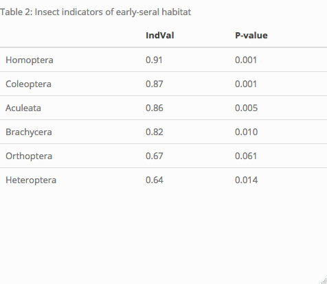
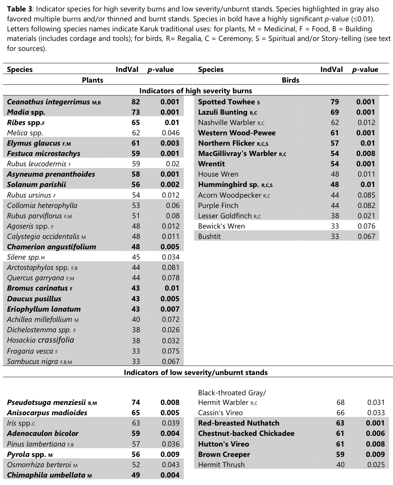

# Results
```{r scripts_methods, include = F}
source("/Users/christopheradlam/Desktop/Davis/R/GitHub Repos/Fire_mosaics/scripts/splist2presabs.R") #function for going from species list to presence/absence
source("/Users/christopheradlam/Desktop/Davis/R/GitHub Repos/Fire_mosaics/scripts/pairwise_permanova.R")
source("/Users/christopheradlam/Desktop/Davis/R/GitHub Repos/Fire_mosaics/scripts/data_load.R")
source("/Users/christopheradlam/Desktop/Davis/R/GitHub Repos/Fire_mosaics/scripts/GeoDistanceInMetresMatrix.R")#contains packages to load
```

```{r canopy_cover, echo = F, out.width="65%", fig.align='center'}
# could use this to calculate percent burnt in each sev category (3 is about 9.3%)
# But the problem with this calculation is that it isn't restricted to mixed evergreen forest... also it's fires that burnt in the WKRP area, but not the exact boundaries.
#fire_sev <- read.csv("/Users/christopheradlam/Desktop/Davis/R/GitHub Repos/Fire_mosaics/Data/fire_sev.csv")

#library(RColorBrewer)
#display.brewer.all(colorblindFriendly = T)
#display.brewer.pal(n = 4, name = 'Dark2')
#brewer.pal(n = 4, name = "Dark2")

cbp1 <- c("#D95F02", "#E7298A", "#7570B3", "#8B5742", "#1B9E77")

UNLS_col <- "#1B9E77"
LS_col <- "#E7298A"
UN_col <- "#8B5742"
Rx_col <- "#7570B3"
mult_col <- "#E7298A"
HS_col <- "#D95F02"

#site_data$sev3 <- factor(site_data$sev3,levels = c("lu", "Rx", "multiple", "h"))
site_data$sev <- factor(site_data$sev,levels = c("h", "multiple", "Rx", "l", "u"))

cover_mod = lm(tree_cov ~ sev, data = site_data)
cover_anova <- anova(cover_mod)
means = emmeans(cover_mod, pairwise~sev)
#cld(means$emmeans, Letters = letters)
cov_cld <- as.data.frame(cld(means$emmeans, Letters = letters))


ggplot(site_data, aes(x = sev, y = tree_cov)) +
  geom_boxplot(aes(fill=sev)) +
  ggtitle("Fig.2: Canopy cover in each severity category") +
  ylab("canopy cover (%)")  +
  xlab("Habitat")  +
  scale_fill_manual(values = cbp1) +
  scale_x_discrete(breaks=c("h", "lu", "multiple", "Rx", "l", "u"),
                      labels=c("HS", "UN/LS", "MULT", "Rx", "LS", "UN"))  +
  geom_text(aes(x = sev, 
                y = 100),#20),
            label = cov_cld$.group, 
            data = cov_cld) +
  theme_cowplot(12) + theme(legend.position = "none")  + theme(aspect.ratio=1)
```

```{r cwd, eval = F, echo = F}
cwd_mod = lm(cwd ~ sev, data = site_data)
cwd_anova <- anova(cwd_mod)
summary.aov(cwd_mod)
#means = emmeans(cwd_mod, pairwise~sev)
#cld(means$emmeans, Letters = letters)
#cwd_cld <- as.data.frame(cld(means$emmeans, Letters = letters))
```

```{r PERMANOVA_plants, echo = F}
comp.data <- plant_dat_cov_w# %>%  #filter(sev %in% c("l", "h", "u"))
#    filter(tsf < 30)

comp.sub <- subset(comp.data, select = ABCO:YAMI)
comp.env <- subset(comp.data, select = c(sev:burn))

sev <- comp.env$sev
tsf <- comp.env$tsf
burn <- comp.env$burn
#tsf <- comp.env$tsf_cat

PERMANOVA_sev_plants <- kable(adonis2(log1p(comp.sub) ~ sev, permutations = 9999), caption = "Table 1: PERMANOVA results (plants, cover)", digits = 5) %>%
  kable_styling()

#adonis2(log1p(comp.sub) ~ (sev*tsf)*burn, permutations = 999)


## Pairwise PERMANOVA
# 1 = High severity; 2 = low-severity; 3 = Unburnt; 4= multiple; 5 = Rx.
#comp.data <- comp.data %>% 
#    dplyr::mutate(sev2 = ifelse(sev == 'h' , "1", ifelse(sev == 'l' , "2", "3")))

# sev only, plant cover
comp.data1 <- comp.data %>% 
    dplyr::mutate(sev2 = ifelse(sev == 'h' , "1", ifelse(sev == 'l' , "2", ifelse(sev == 'u', "3", ifelse(sev == 'multiple', "4", "5")))))

pair_plants <- pairwise.adonis(log1p(comp.sub), comp.data1$sev2) %>% 
  dplyr::select(pairs, df_mod, df_res, F.Model, p.adjusted)

pairwise_sev_plants <- kable(format(pair_plants, digits=2), caption = "Table 2: pairwise PERMANOVA results") %>%
  kable_styling()

# tsf only, plant cover
#comp.data1 <- comp.data# %>% 
#    dplyr::mutate(sev2 = ifelse(sev == 'h' , "1", ifelse(sev == 'l' , "2", ifelse(sev == 'u', "3", ifelse(sev == 'multiple', "4", "5")))))

#pair_plants <- pairwise.adonis(log1p(comp.sub), comp.data1$tsf_cat) %>% 
#  dplyr::select(pairs, F.Model, p.adjusted)

#pairwise_sev_plants <- kable(pair_plants, caption = "Table 2: pairwise PERMANOVA results", digits = 5) %>%
#  kable_styling()


```

```{r PERMANOVA_birds, echo = F}
#birds
comp.data <- bird_dat_w #%>%  #filter(sev %in% c("l", "h", "u"))
#  filter((tsf < 25 & tsf > 4) | sev == "u")# %>%
#  filter((sev == "multiple" & tree_cov > 45) | sev != "multiple")
  
comp.sub <- subset(comp.data, select = ACWO:YRWA)
comp.env <- subset(comp.data, select = c(sev:tsf_num))

sev <- comp.env$sev
tsf <- comp.env$tsf
burn <- comp.env$burn

PERMANOVA_sev_birds <- kable(adonis2(comp.sub ~ sev, permutations = 9999), caption = "Table 1: PERMANOVA results", digits = 5) %>%
  kable_styling() 

#adonis2(comp.sub ~ (sev*tsf)*burn, permutations = 999)

## Pairwise PERMANOVA function (run)
# 1 = High severity; 2 = low-severity; 3 = Unburnt; 4= multiple; 5 = Rx.
#comp.data <- comp.data %>% 
#    dplyr::mutate(sev2 = ifelse(sev == 'h' , "1", ifelse(sev == 'l' , "2", "3")))

# sev only, plant cover
comp.data1 <- comp.data %>% 
    dplyr::mutate(sev2 = ifelse(sev == 'h' , "1", ifelse(sev == 'l' , "2", ifelse(sev == 'u', "3", ifelse(sev == 'multiple', "4", "5")))))

pair_birds <- format(pairwise.adonis((comp.sub), comp.data1$sev2) %>% 
  dplyr::select(pairs, df_mod, df_res, F.Model, p.adjusted, sig), digits = 3)

pairwise_sev_birds <- kable(format(pair_birds, digits= 2), caption = "Table 2: pairwise PERMANOVA results") %>%
  kable_styling()

# tsf only, plant cover
#comp.data1 <- comp.data #%>% 
#    dplyr::mutate(sev2 = ifelse(sev == 'h' , "1", ifelse(sev == 'l' , "2", ifelse(sev == 'u', "3", ifelse(sev == 'multiple', "4", "5")))))

#pair_birds <- pairwise.adonis((comp.sub), comp.data1$tsf_cat) %>% 
#  dplyr::select(pairs, F.Model, p.adjusted)

#pairwise_sev_birds <- kable(pair_birds, caption = "Table 2: pairwise PERMANOVA results", digits = 4) %>%
#  kable_styling()

```

```{r PERMANOVA_lichens, echo = F}
#lichens
comp.data <- lichen_dat_species_pa_w#%>%  #filter(sev %in% c("l", "h", "u"))
#  filter((tsf < 25 & tsf > 4) | sev == "u")# %>%
#  filter((sev == "multiple" & tree_cov > 45) | sev != "multiple")
#lichen_mat_species_w %>% mutate(DUMMY = 1)  
  
comp.sub <- subset(comp.data, select = -c(fire:tsf_num, site_id))
comp.env <- subset(comp.data, select = c(fire:tsf_num))

sev <- comp.env$sev
tsf <- comp.env$tsf_cat
#burn <- comp.env$burn

PERMANOVA_sev_lichens <- kable(format(adonis2(comp.sub ~ sev, permutations = 9999), caption = "Table 1: PERMANOVA results"), digits = 3) %>%
  kable_styling() 

#adonis2(comp.sub ~ (sev*tsf)*burn, permutations = 999)


## Pairwise PERMANOVA function (run)
# 1 = High severity; 2 = low-severity; 3 = Unburnt; 4= multiple; 5 = Rx.
#comp.data <- comp.data %>% 
#    dplyr::mutate(sev2 = ifelse(sev == 'h' , "1", ifelse(sev == 'l' , "2", "3")))

# sev only, plant cover
comp.data1 <- comp.data %>% 
    dplyr::mutate(sev2 = ifelse(sev == 'h' , "1", ifelse(sev == 'l' , "2", ifelse(sev == 'u', "3", ifelse(sev == 'multiple', "4", "5")))))

pair_lichens <- format(pairwise.adonis(comp.sub, comp.data1$sev2) %>% 
  dplyr::select(pairs, df_mod, df_res, F.Model, p.value,  p.adjusted, sig), digits = 2)

pairwise_sev_lichens <- kable(format(pair_lichens, digits = 2), caption = "Table 2: pairwise PERMANOVA results") %>%
  kable_styling()

# tsf only, plant cover
#comp.data1 <- comp.data #%>% 
#    dplyr::mutate(sev2 = ifelse(sev == 'h' , "1", ifelse(sev == 'l' , "2", ifelse(sev == 'u', "3", ifelse(sev == 'multiple', "4", "5")))))

#pair_lichens <- pairwise.adonis((comp.sub), comp.data1$tsf_cat) %>% 
#  dplyr::select(pairs, F.Model, p.adjusted)

#pairwise_sev_lichens <- kable(pair_lichens, caption = "Table 2: pairwise PERMANOVA results", digits = 4) %>%
#  kable_styling()
```

```{r all_pairwise_table, echo = F}
# Making a table of all pairwise comparisons
pairs <- c("HS vs LS", "LS vs MULT", "LS vs UN", "LS vs Rx", "HS vs MULT", "HS vs UN", "HS vs Rx", "MULT vs UN", "MULT vs Rx", "UN vs RX")
plants_F <-pair_plants$F.Model
plants_P <-pair_plants$p.adjusted
birds_F <-pair_birds$F.Model
birds_P <-pair_birds$p.adjusted
lichens_F <- pair_lichens$F.Model
lichens_P <-pair_lichens$p.adjusted

all_pairwise_table <- data.frame(pairs, plants_F, plants_P, birds_F, birds_P, lichens_F,lichens_P)

names(all_pairwise_table) <- c("Pair", "F_model", "p_adj", "F_model", "p_adj", "F_model", "p_adj")

all_pairwise_table <- all_pairwise_table[order(all_pairwise_table$Pair),]
rownames(all_pairwise_table) <- c()

kable(all_pairwise_table, digits = 3, caption = "Pairwise PERMANOVA results") %>% 
  kable_styling("hover", full_width = F) %>%
  add_header_above(c(" ", "plants" = 2, "birds" = 2, "lichens" = 2)) %>% 
  save_kable("output/pair_perm.png")
```


## Variation in community composition across habitats

### Effect of fire history on species composition
The main PERMANOVA revealed that species composition varies for all taxa in response to the severity category (*p* < 0.001). Using pairwise PERMANOVAs to compare the habitats, there is no detectable difference between plant, bird or lichen communities of low-severity and unburnt stands (Table 1) (plants: pseudo-*F*~(`r pair_plants[3,2]`,`r pair_plants[3,3]`)~ = `r round(pair_plants[3,4], 2)` and *p* = `r pair_plants[3,5]`; birds: pseudo-*F*~(`r pair_birds[3,2]`,`r pair_birds[3,3]`)~  = `r pair_birds[3,4]` and *p* = `r pair_birds[3,5]`; lichens: pseudo-*F*~(`r pair_lichens[3,2]`,`r pair_lichens[3,3]`)~ = `r pair_lichens[3,4]` and *p* = `r (pair_lichens[3,6])`). In addition, bird communities of high severity burns and multiple burns are not detectably different (pseudo-*F*~(`r pair_birds[5,2]`,`r pair_birds[5,3]`)~ = `r pair_birds[5,4]` and *p* = `r pair_birds[5,5]`). For lichens, the only habitat that stands out is the HS habitat (*p* < 0.02), although it is not statistically different from the MULT habitat (*p* = 1).


```{r NMDS, echo=FALSE,results='hide'}
#,results='hide',fig.keep='all'
# read in data
NMDS.log <- (all_spp_w_pa[,-1])

sol <- metaMDS(NMDS.log, k = 3, distance = "bray", previous.best = T, maxit = 50, weakties = T, try  = 50, trymax = 100)

scrs <- as.data.frame(scores(sol, display = "sites"))
scrs <- cbind(scrs, site_id = all_spp_w_pa$site_id)
scrs <- merge(scrs, site_data, by = "site_id")

vf <- envfit(sol, NMDS.log, perm = 9)

spp.scrs <- as.data.frame(scores(vf, display = "vectors"))
spp.scrs <- cbind(spp.scrs, Species = rownames(spp.scrs))

# To only show statistically significant species:
ef<-envfit(sol$points, NMDS.log, perm=1000)
ef.df<-as.data.frame(ef$vectors$arrows*sqrt(ef$vectors$r))

ef.df<-data.frame(ef$vectors$arrows,R = ef$vectors$r, P = ef$vectors$pvals)

ef.df$species<-rownames(ef.df)

#only significant pvalues
#shortcutting ef$vectors
A <- as.list(ef$vectors)
#creating the dataframe
pvals<-as.data.frame(A$pvals)
arrows<-as.data.frame(A$arrows*sqrt(A$r))
C<-cbind(arrows, pvals)
#subset
Cred<-subset(C,pvals<0.001)
Cred <- cbind(Cred, Species = rownames(Cred))

#scrs$cov_cat <- as.factor(scrs$cov_cat)
#only stat. signif. spp
p <- ggplot(scrs, mapping = aes(x = NMDS1, y = NMDS2)) +
  geom_point(aes(colour = sev)) +
  coord_fixed() + ## need aspect ratio of 1!
  stat_ellipse(level = 0.9, aes(colour = sev)) +
#  geom_segment(data = Cred,
#               aes(x = 0, xend = MDS1, y = 0, yend = MDS2),
#               arrow = arrow(length = unit(0.25, "cm")), colour = "grey") +
#  geom_text(data = Cred, aes(x = MDS1, y = MDS2, label = Species), size = 3) +
  theme_cowplot(12)+
#  labs(colour = "Severity Category") +
  scale_colour_discrete(name = "Severity Category", labels = c("High Severity", "Multiple", "Thin+Burn", "low-severity", "Unburnt")) +
  labs(title = "Figure 3: NMDS for all species. Ellipses represent 90% CI.")
p
```

### Species assemblage ordination

The NMDS confirms a considerable overlap in species communities of long-unburnt and low-severity burn stands. High severity stands have distinct species communities, while the communities in thinned and burnt stands and multiple burn stands appear to be intermediate between the high severity stands and long-unburnt/low-severity stands. Figure 3 shows the first two dimensions of a 3-dimensional ordination that found convergent solutions with a stress of `r round(sol$stress, 3)` ("stress" represents the degree of distortion required to reduce the dimensionality of the data; a stress of <0.20 is considered acceptable).

## Alpha, Beta, Gamma diversity patterns

### Alpha diversity

```{r echo = FALSE}
# First, make data frame with richness for each taxa at each site
# species richness at each plot (from http://www.flutterbys.com.au/stats/tut/tut13.2.html)
all_richness <- ddply(all_spp_w_pa,~site_id,function(x) {
   data.frame(richness=sum(x[-1]>0))
 })

all_div1 <- merge(all_richness, site_data, by = "site_id") 

# Birds
# species richness at each plot (from http://www.flutterbys.com.au/stats/tut/tut13.2.html)
bird_richness <- ddply(bird_mat_w,~site_id,function(x) {
   data.frame(richness=sum(x[-1]>0))
 })

bird_div1 <- merge(bird_richness, site_data, by = "site_id")

# Plants
# species richness at each plot (from http://www.flutterbys.com.au/stats/tut/tut13.2.html)
plant_richness <- ddply(plant_mat_pa_w,~site_id,function(x) {
   data.frame(richness=sum(x[-1]>0))
 })

plant_div1 <- merge(plant_richness, site_data, by = "site_id")

# Lichens
# species richness at each plot (from http://www.flutterbys.com.au/stats/tut/tut13.2.html)
lichen_richness <- ddply(lichen_mat_species_pa_w,~site_id,function(x) {
   data.frame(richness=sum(x[-1]>0))
 })

lichen_div1 <- merge(lichen_richness, site_data, by = "site_id")
```

```{r echo = FALSE}
# Put it together
# richness tests
div <- all_div1 %>% dplyr::mutate(., rich_all = richness) %>% 
  dplyr::select(-richness) %>% 
  merge(., bird_div1[, c(1:2)], by = "site_id") %>% dplyr::mutate(., rich_bird = richness) %>%
  dplyr::select(-richness) %>% 
  merge(., plant_div1[, c(1:2)], by = "site_id") %>% dplyr::mutate(., rich_plant = richness) %>%
  dplyr::select(-richness) %>% 
  merge(., lichen_div1[, c(1:2)], by = "site_id") %>% dplyr::mutate(., rich_lichen = richness) %>%
  dplyr::select(-richness)
```

```{r alpha_cld, include = FALSE}
# Now making the cld letters for the plots
#12/12/19
#  LU is statistically different (lower), RX is statistically different (higher); h is similar to lu and mult; mult is similar to h but separate from Rx (lu:a; h:ab; mult:b; Rx:c)

mod_add_tsf = lm(rich_bird ~ tsf_cat, data = div %>% dplyr::filter(sev != "u"))
anova(mod_add_tsf)
means = emmeans(mod_add_tsf, pairwise~tsf_cat)
cld(means$emmeans, Letters = letters)
alpha_rich_stats_all <- as.data.frame(cld(means$emmeans, Letters = letters))

mod_add_all = lm(rich_all ~ sev, data = div)
anova(mod_add_all)
means = emmeans(mod_add_all, pairwise~sev)
cld(means$emmeans, Letters = letters)
alpha_rich_stats_all <- as.data.frame(cld(means$emmeans, Letters = letters))

#  LU is statistically different (lower), RX is statistically different (higher); h is similar to lu and mult; mult is similar to h and Rx (a; ab; bc; c)
mod_add_bird = lm(rich_bird ~ sev, data = div)
anova(mod_add_bird)
means = emmeans(mod_add_bird, pairwise~sev)
cld(means$emmeans, Letters = letters)
alpha_rich_stats_bird <- as.data.frame(cld(means$emmeans, Letters = letters))

#similar to bird pattern (lu: a, h: ab, mult:bc, Rx:c)
mod_add_plant = lm(rich_plant ~ sev, data = div)
anova(mod_add_plant)
means = emmeans(mod_add_plant, pairwise~sev)
cld(means$emmeans, Letters = letters)
alpha_rich_stats_plant <- as.data.frame(cld(means$emmeans, Letters = letters))

# LU is statistically different (higher), yet not different from Rx; h and mult are higher, though not diff from Rx. (h: a, mult: a, Rx: ab, lu:b)
mod_add_lichen = lm(rich_lichen ~ sev, data = div)
anova(mod_add_lichen)
means = emmeans(mod_add_lichen, pairwise~sev)
cld(means$emmeans, Letters = letters)
alpha_rich_stats_lichen <- as.data.frame(cld(means$emmeans, Letters = letters))
```

```{r all_alpha, echo = FALSE}
all_alpha <- ggplot(all_div1, aes(x = sev, y = richness, fill = sev)) +
  geom_boxplot() +
  ggtitle("All spp richness") +
  xlab("Habitat")  +
  geom_text(aes(x = sev, 
                y = emmean + 25),
            label = alpha_rich_stats_all$.group, 
            data = alpha_rich_stats_all) +
  scale_fill_manual(values = cbp1) +
  scale_x_discrete(breaks=c("u", "l", "Rx", "multiple", "h"),
                      labels=c("UN", "LS", "MULT", "Rx", "HS")) +
  theme_cowplot(12) + theme(legend.position = "none")  + theme(aspect.ratio=1)

```

```{r bird_alpha, echo = FALSE}
bird_alpha <- ggplot(bird_div1, aes(x = sev, y = richness, fill = sev)) +
  geom_boxplot() +
  ggtitle("Bird richness") +
  xlab("Habitat")  +
  geom_text(aes(x = sev, 
                y = emmean + 8),
            label = alpha_rich_stats_bird$.group, 
            data = alpha_rich_stats_bird) +
  scale_fill_manual(values = cbp1) +
  scale_x_discrete(breaks=c("u", "l", "Rx", "multiple", "h"),
                      labels=c("UN", "LS", "Rx", "MULT", "HS")) +
  theme_cowplot(12) + theme(legend.position = "none")  + theme(aspect.ratio=1)

```

```{r plant_alpha, echo = FALSE}
# p/a; cov is separate
plant_alpha <- ggplot(plant_div1, aes(x = sev, y = richness, fill = sev)) +
  geom_boxplot() +
  ggtitle("Plant richness") +
  xlab("Habitat")  +
  geom_text(aes(x = sev, 
                y = emmean + 22),
            label = alpha_rich_stats_plant$.group, 
            data = alpha_rich_stats_plant) +
  scale_fill_manual(values = cbp1) +
  scale_x_discrete(breaks=c("u", "l", "Rx", "multiple", "h"),
                      labels=c("UN", "LS", "Rx", "MULT", "HS")) +
  theme_cowplot(12) + theme(legend.position = "none")  + theme(aspect.ratio=1)

```

```{r lichen_alpha, echo = FALSE}
lich_alpha <- ggplot(lichen_div1, aes(x = sev, y = richness, fill = sev)) +
  geom_boxplot() +
  ggtitle("lichen richness") +
  xlab("Habitat")  +
  geom_text(aes(x = sev, 
                y = emmean + 20),
            label = alpha_rich_stats_lichen$.group, 
            data = alpha_rich_stats_lichen) +
  scale_fill_manual(values = cbp1) +
  scale_x_discrete(breaks=c("u", "l", "Rx", "multiple", "h"),
                      labels=c("UN", "LS", "Rx", "MULT", "HS")) +
  theme_cowplot(12) + theme(legend.position = "none")  + theme(aspect.ratio=1)

```

```{r alpha_figures, echo = FALSE, fig.width=8, fig.height=6}
### All alpha plots
#(except insects)
grid.arrange(bird_alpha, plant_alpha, lich_alpha, nrow = 1, bottom = "Fig.4: Bird, plant and lichen species richness")

```

```{r rich_anovas, echo = FALSE, include=FALSE}
#does tree cover affter species richness in the mult/Rx and l/u habitats?
#mutl/Rx
#plants
multrx <-div %>% dplyr::filter(sev3 == "multiple" | sev == "Rx")

multrx_mod <- lm(rich_plant ~ tree_cov, multrx)
multrx_anova <- anova(multrx_mod)
#ggplot(multrx, aes(x=tree_cov, y = rich_plant)) + geom_point() + geom_smooth(method = lm)

f_multrx <- unname(summary(multrx_mod)$fstatistic[1])
df_mod_multrx <- unname(summary(multrx_mod)$fstatistic[2])
df_res_multrx <- unname(summary(multrx_mod)$fstatistic[3])
rsq_multrx <- summary(multrx_mod)$r.squared
p_multrx <- pf(f_multrx, df_mod_multrx, df_res_multrx, lower.tail = FALSE)

#birds
multrx_b <-div %>% dplyr::filter(sev3 == "multiple" | sev == "Rx")

multrx_b_mod <- lm(rich_plant ~ tree_cov, multrx_b)
multrx_b_anova <- anova(multrx_b_mod)
#ggplot(multrx_b, aes(x=tree_cov, y = rich_plant)) + geom_point() + geom_smooth(method = lm)

f_multrx_b <- unname(summary(multrx_b_mod)$fstatistic[1])
df_mod_multrx_b <- unname(summary(multrx_b_mod)$fstatistic[2])
df_res_multrx_b <- unname(summary(multrx_b_mod)$fstatistic[3])
rsq_multrx_b <- summary(multrx_b_mod)$r.squared
p_multrx_b <- pf(f_multrx_b, df_mod_multrx_b, df_res_multrx_b, lower.tail = FALSE)

#unls
#plants
lu_p <- div %>% dplyr::filter(sev3 == "lu")

lu_p_mod <- lm(rich_plant ~ tree_cov, lu_p)
lu_p_anova <- anova(lu_p_mod)

f_lu_p <- unname(summary(lu_p_mod)$fstatistic[1])
df_mod_lu_p <- unname(summary(lu_p_mod)$fstatistic[2])
df_res_lu_p <- unname(summary(lu_p_mod)$fstatistic[3])
rsq_lu_p <- summary(lu_p_mod)$r.squared
p_lu_p <- pf(f_lu_p, df_mod_lu_p, df_res_lu_p, lower.tail = FALSE)

#birds
lu_b <-div %>% dplyr::filter(sev3 == "lu")

lu_b_mod <- lm(rich_bird ~ tree_cov, lu_b)
lu_b_anova <- anova(lu_b_mod)

f_lu_b <- unname(summary(lu_b_mod)$fstatistic[1])
df_mod_lu_b <- unname(summary(lu_b_mod)$fstatistic[2])
df_res_lu_b <- unname(summary(lu_b_mod)$fstatistic[3])
rsq_lu_b <- summary(lu_b_mod)$r.squared
p_lu_b <- pf(f_lu_b, df_mod_lu_b, df_res_lu_b, lower.tail = FALSE)

#HS
#plants
hs <-div %>% dplyr::filter(sev3 == "h")

hs_p_mod <- lm(rich_plant ~ tree_cov, hs)
hs_anova <- anova(hs_p_mod)

f_hs_p <- unname(summary(hs_p_mod)$fstatistic[1])
df_mod_hs_p <- unname(summary(hs_p_mod)$fstatistic[2])
df_res_hs_p <- unname(summary(hs_p_mod)$fstatistic[3])
rsq_hs_p <- summary(hs_p_mod)$r.squared
p_hs_p <- pf(f_hs_p, df_mod_hs_p, df_res_hs_p, lower.tail = FALSE)

#birds
hs <-div %>% dplyr::filter(sev3 == "h")

hs_b_mod <- lm(rich_bird ~ tree_cov, hs)
hs_anova <- anova(hs_b_mod)

f_hs_b <- unname(summary(hs_b_mod)$fstatistic[1])
df_mod_hs_b <- unname(summary(hs_b_mod)$fstatistic[2])
df_res_hs_b <- unname(summary(hs_b_mod)$fstatistic[3])
rsq_hs_b <- summary(hs_b_mod)$r.squared
p_hs_b <- pf(f_hs_b, df_mod_hs_b, df_res_hs_b, lower.tail = FALSE)

#ggplot(multrx, aes(x=shrub_cov, y = rich_plant)) + geom_point() + geom_smooth(method = lm)
```
  
Bird and plant species richness were highest in the multiple burns and thinned and burnt stands (for plants the difference between high severity burns and multiple burns was not significant) (Figure 4). Bird and plant richness in low-severity burns and unburnt plots was slightly lower than in high severity burns, but the difference was overall not significant. Lichens were predictably less diverse in the high severity stands, but richness in the other severity categories was similar.

Within the multiple burns and thinned and burnt stands, canopy cover was negatively correlated with plant richness (*F*~(1,44)~ = `r round(f_multrx, 3)`, *p* = `r round(p_multrx, 3)`) and bird richness (*F*~(1,44)~ = `r round(f_multrx_b, 3)`, *p* = `r round(p_multrx_b, 3)`). In the low-severity and long-unburnt stands, canopy cover was negatively correlated with bird richness (*F*~(1,35)~ = `r round(f_lu_b, 3)`, *p* = `r round(p_lu_b, 3)`), but only weakly correlated with plant richness (*F*~(1,35)~ = `r round(f_lu_p, 3)`, *p* = `r round(p_lu_p, 3)`). In the high severity stands, canopy cover was not correlated with either plant or bird richness (*F*~(1,25)~ = `r round(f_hs_p, 3)`, *p* = `r round(p_hs_p, 3)` and *F*~(1,25)~ = `r round(f_hs_b, 3)`, *p* = `r round(p_hs_b, 3)` respectively).

### Beta Diversity

Beta diversity was highest in the high severity burns and multiple burns for birds and plants, and lowest for the thinned and burnt stands, possibly because they were spatially clustered rather than because of an effect of treatment (figure 5). For lichens, high severity burns had the highest beta diversity, likely not because of a high level of species turnover between sites, but rather because of the variation in species richness between plots with no surviving trees and those that had surviving trees, and therefore lichens.

```{r beta_vegetarian, echo = FALSE, fig.width=8, fig.height=6 ,results='hide'}
#library(vegetarian)

# Plant beta
plant_h_beta <- plant_dat_pa_w %>% dplyr::filter(sev=="h") %>% dplyr::select(ABCO:YAMI)
#plant_lu_beta <- plant_dat_pa_w %>% dplyr::filter(sev3=="lu") %>% dplyr::select(ABCO:YAMI)
plant_u_beta <- plant_dat_pa_w %>% dplyr::filter(sev=="u") %>% dplyr::select(ABCO:YAMI)
plant_l_beta <- plant_dat_pa_w %>% dplyr::filter(sev=="l") %>% dplyr::select(ABCO:YAMI)
plant_mult_beta <- plant_dat_pa_w %>% dplyr::filter(sev3=="multiple") %>% dplyr::select(ABCO:YAMI)
plant_Rx_beta <- plant_dat_pa_w %>% dplyr::filter(sev3=="Rx") %>% dplyr::select(ABCO:YAMI)

## Jaccard
h_beta<-d(plant_h_beta[,-1],lev="beta", q=0, boot=TRUE)
#lu_beta<-d(plant_lu_beta[,-1],lev="beta", q=0, boot=TRUE)
u_beta<-d(plant_u_beta[,-1],lev="beta", q=0, boot=TRUE)
l_beta<-d(plant_l_beta[,-1],lev="beta", q=0, boot=TRUE)
mult_beta<-d(plant_mult_beta[,-1],lev="beta", q=0, boot=TRUE)
Rx_beta <- d(plant_Rx_beta[,-1],lev="beta", q=0, boot=TRUE)

df <- data.frame(
  sev = factor(c("h", "u", "l", "mult", "Rx")),
  beta = c(h_beta$D.Value, u_beta$D.Value, l_beta$D.Value, mult_beta$D.Value, Rx_beta$D.Value),
  stderr = c(h_beta$StdErr, u_beta$StdErr, l_beta$StdErr, mult_beta$StdErr, Rx_beta$StdErr)
#  lower = c(0.8, 4.6, 2.4, 3.6)
)

df$sev <- factor(df$sev,levels = c("h", "mult", "Rx", "l", "u"))

p_BD_jaccard <- ggplot(df, aes(sev, beta)) + 
  geom_errorbar(aes(ymin = beta-stderr, ymax = beta+stderr, color = sev), width = 0.2) + 
  geom_point(aes(color = sev)) +
  theme_cowplot(12)  +
  scale_x_discrete(breaks=c("u", "l", "Rx", "mult", "h"),
                      labels=c("UN", "LS", "Rx", "MULT", "HS")) +
  xlab("Fire Severity") +
  ylab("Beta diversity (Jaccard, \u00B1 SE)") +
  ggtitle("Plant Beta diversity") + theme(aspect.ratio=1) +
  scale_color_manual(values = cbp1) + theme(legend.position = "none") 


## Shannon
h_beta<-d(plant_h_beta[,-1],lev="beta", q=1, boot=TRUE)
#lu_beta<-d(plant_lu_beta[,-1],lev="beta", q=1, boot=TRUE)
u_beta<-d(plant_u_beta[,-1],lev="beta", q=1, boot=TRUE)
l_beta<-d(plant_l_beta[,-1],lev="beta", q=1, boot=TRUE)
mult_beta<-d(plant_mult_beta[,-1],lev="beta", q=1, boot=TRUE)
Rx_beta <- d(plant_Rx_beta[,-1],lev="beta", q=1, boot=TRUE)


df <- data.frame(
  sev = factor(c("h", "u", "l", "mult", "Rx")),
  beta = c(h_beta$D.Value, u_beta$D.Value, l_beta$D.Value, mult_beta$D.Value, Rx_beta$D.Value),
  stderr = c(h_beta$StdErr, u_beta$StdErr, l_beta$StdErr, mult_beta$StdErr, Rx_beta$StdErr)
#  lower = c(0.8, 4.6, 2.4, 3.6)
)

p_BD_shannon <- ggplot(df, aes(sev, beta)) + 
  geom_errorbar(aes(ymin = beta-stderr, ymax = beta+stderr), width = 0.2) + 
  geom_point() +
  theme_cowplot(12) +
  xlab("Fire Severity") +
  ylab("Beta diversity (Shannon, \u00B1 SE)") + theme(aspect.ratio=1)#+
 # ggtitle("Beta diversity (plants, Shannon)")


# bird beta
bird_h_beta <- bird_dat_w %>% dplyr::filter(sev=="h") %>% dplyr::select(ACWO:YRWA)
#bird_lu_beta <- bird_dat_w %>% dplyr::filter(sev3=="lu") %>% dplyr::select(ACWO:YRWA)
bird_u_beta <- bird_dat_w %>% dplyr::filter(sev=="u") %>% dplyr::select(ACWO:YRWA)
bird_l_beta <- bird_dat_w %>% dplyr::filter(sev=="l") %>% dplyr::select(ACWO:YRWA)
bird_mult_beta <- bird_dat_w %>% dplyr::filter(sev3=="multiple") %>% dplyr::select(ACWO:YRWA)
bird_Rx_beta <- bird_dat_w %>% dplyr::filter(sev3=="Rx") %>% dplyr::select(ACWO:YRWA)

## Jaccard
h_beta<-d(bird_h_beta[,-1],lev="beta", q=0, boot=TRUE)
#lu_beta<-d(bird_lu_beta[,-1],lev="beta", q=0, boot=TRUE)
u_beta<-d(bird_u_beta[,-1],lev="beta", q=0, boot=TRUE)
l_beta<-d(bird_l_beta[,-1],lev="beta", q=0, boot=TRUE)
mult_beta<-d(bird_mult_beta[,-1],lev="beta", q=0, boot=TRUE)
Rx_beta <- d(bird_Rx_beta[,-1],lev="beta", q=0, boot=TRUE)

df <- data.frame(
  sev = factor(c("h", "u", "l", "mult", "Rx")),
  beta = c(h_beta$D.Value, u_beta$D.Value, l_beta$D.Value, mult_beta$D.Value, Rx_beta$D.Value),
  stderr = c(h_beta$StdErr, u_beta$StdErr, l_beta$StdErr, mult_beta$StdErr, Rx_beta$StdErr)
#  lower = c(0.8, 4.6, 2.4, 3.6)
)

df$sev <- factor(df$sev,levels = c("h", "mult", "Rx", "l", "u"))

b_BD_jaccard <- ggplot(df, aes(sev, beta)) + 
  geom_errorbar(aes(ymin = beta-stderr, ymax = beta+stderr, color = sev), width = 0.2) + 
  geom_point(aes(color = sev)) +
  theme_cowplot(12)  +
  scale_x_discrete(breaks=c("u", "l", "Rx", "mult", "h"),
                      labels=c("UN", "LS", "Rx", "MULT", "HS")) +
  xlab("Fire Severity") +
  ylab("Beta diversity (Jaccard, \u00B1 SE)") +
  ggtitle("Bird Beta diversity") + theme(aspect.ratio=1) +
  scale_color_manual(values = cbp1) + theme(legend.position = "none") 


## Shannon
h_beta<-d(bird_h_beta[,-1],lev="beta", q=1, boot=TRUE)
#lu_beta<-d(bird_lu_beta[,-1],lev="beta", q=1, boot=TRUE)
u_beta<-d(bird_u_beta[,-1],lev="beta", q=1, boot=TRUE)
l_beta<-d(bird_l_beta[,-1],lev="beta", q=1, boot=TRUE)
mult_beta<-d(bird_mult_beta[,-1],lev="beta", q=1, boot=TRUE)
Rx_beta <- d(bird_Rx_beta[,-1],lev="beta", q=1, boot=TRUE)


df <- data.frame(
  sev = factor(c("h", "u", "l", "mult", "Rx")),
  beta = c(h_beta$D.Value, u_beta$D.Value, l_beta$D.Value, mult_beta$D.Value, Rx_beta$D.Value),
  stderr = c(h_beta$StdErr, u_beta$StdErr, l_beta$StdErr, mult_beta$StdErr, Rx_beta$StdErr)
#  lower = c(0.8, 4.6, 2.4, 3.6)
)

b_BD_shannon <- ggplot(df, aes(sev, beta)) + 
  geom_errorbar(aes(ymin = beta-stderr, ymax = beta+stderr), width = 0.2) + 
  geom_point() +
  theme_cowplot(12) +
  xlab("Fire Severity") +
  ylab("Beta diversity (Shannon, \u00B1 SE)") + theme(aspect.ratio=1)#+
#  ggtitle("Beta diversity (birds, Shannon)")


# lichen beta
lichen_h_beta <- lichen_dat_species_pa_w %>% dplyr::filter(sev=="h") %>% dplyr::select(site_id:DUMMY) %>% dplyr::select(-site_id)
#lichen_lu_beta <- lichen_dat_species_pa_w %>% dplyr::filter(sev3=="lu") %>% dplyr::select(site_id:DUMMY) %>% dplyr::select(-site_id)
lichen_u_beta <- lichen_dat_species_pa_w %>% dplyr::filter(sev=="u") %>% dplyr::select(site_id:DUMMY) %>% dplyr::select(-site_id)
lichen_l_beta <- lichen_dat_species_pa_w %>% dplyr::filter(sev=="l") %>% dplyr::select(site_id:DUMMY) %>% dplyr::select(-site_id)
lichen_mult_beta <- lichen_dat_species_pa_w %>% dplyr::filter(sev3=="multiple") %>% dplyr::select(site_id:DUMMY) %>% dplyr::select(-site_id)
lichen_Rx_beta <- lichen_dat_species_pa_w %>% dplyr::filter(sev3=="Rx") %>% dplyr::select(site_id:DUMMY) %>% dplyr::select(-site_id)

## Jaccard
h_beta<-d(lichen_h_beta[,-1],lev="beta", q=0, boot=TRUE)
#lu_beta<-d(lichen_lu_beta[,-1],lev="beta", q=0, boot=TRUE)
u_beta<-d(lichen_u_beta[,-1],lev="beta", q=0, boot=TRUE)
l_beta<-d(lichen_l_beta[,-1],lev="beta", q=0, boot=TRUE)
mult_beta<-d(lichen_mult_beta[,-1],lev="beta", q=0, boot=TRUE)
Rx_beta <- d(lichen_Rx_beta[,-1],lev="beta", q=0, boot=TRUE)

df <- data.frame(
  sev = factor(c("h", "u", "l", "mult", "Rx")),
  beta = c(h_beta$D.Value, u_beta$D.Value, l_beta$D.Value, mult_beta$D.Value, Rx_beta$D.Value),
  stderr = c(h_beta$StdErr, u_beta$StdErr, l_beta$StdErr, mult_beta$StdErr, Rx_beta$StdErr)
#  lower = c(0.8, 4.6, 2.4, 3.6)
)

df$sev <- factor(df$sev,levels = c("h", "mult", "Rx", "l", "u"))

l_BD_jaccard <- ggplot(df, aes(sev, beta)) + 
  geom_errorbar(aes(ymin = beta-stderr, ymax = beta+stderr, color = sev), width = 0.2) + 
  geom_point(aes(color = sev)) +
  theme_cowplot(12)  +
  scale_x_discrete(breaks=c("u", "l", "Rx", "mult", "h"),
                      labels=c("UN", "LS", "Rx", "MULT", "HS")) +
  xlab("Fire Severity") +
  ylab("Beta diversity (Jaccard, \u00B1 SE)") +
  ggtitle("Lichen Beta diversity") + theme(aspect.ratio=1) +
  scale_color_manual(values = cbp1) + theme(legend.position = "none") 


## Shannon
h_beta<-d(lichen_h_beta[,-1],lev="beta", q=1, boot=TRUE)
#lu_beta<-d(lichen_lu_beta[,-1],lev="beta", q=1, boot=TRUE)
u_beta<-d(lichen_u_beta[,-1],lev="beta", q=1, boot=TRUE)
l_beta<-d(lichen_l_beta[,-1],lev="beta", q=1, boot=TRUE)
mult_beta<-d(lichen_mult_beta[,-1],lev="beta", q=1, boot=TRUE)
Rx_beta <- d(lichen_Rx_beta[,-1],lev="beta", q=1, boot=TRUE)

df <- data.frame(
  sev = factor(c("h", "u", "l", "mult", "Rx")),
  beta = c(h_beta$D.Value, u_beta$D.Value, l_beta$D.Value, mult_beta$D.Value, Rx_beta$D.Value),
  stderr = c(h_beta$StdErr, u_beta$StdErr, l_beta$StdErr, mult_beta$StdErr, Rx_beta$StdErr)
#  lower = c(0.8, 4.6, 2.4, 3.6)
)

l_BD_shannon <- ggplot(df, aes(sev, beta)) + 
  geom_errorbar(aes(ymin = beta-stderr, ymax = beta+stderr), width = 0.2) + 
  geom_point() +
  theme_cowplot(12) +
  xlab("Fire Severity") +
  ylab("Beta diversity (Shannon, \u00B1 SE)") + theme(aspect.ratio=1)#+
  #ggtitle("Beta diversity (lichens, Shannon)")


```

```{r beta_figures_vegetarian, echo = FALSE, fig.width=8, fig.height=6}
### All beta plots
# grid.arrange(b_BD_jaccard, b_BD_shannon, p_BD_jaccard, p_BD_shannon, l_BD_jaccard, l_BD_shannon, nrow = 3, bottom = "Fig.2: Bird, plant and lichen beta diversity (left: Jaccard; right: Shannon)")

#Jaccard only
grid.arrange(b_BD_jaccard, p_BD_jaccard, l_BD_jaccard, nrow = 1, bottom = "Fig.5: Bird, plant and lichen beta diversity (Jaccard)")
```

### Gamma diversity

Based on the extrapolated species richness, the total pool of species for birds appears to be largest in the multiple burns and thinned and burnt stands, intermediate in the high severity burns, and lowest in the low-severity and long-unburnt stands (Fig. 5). For plants, the pattern is the same except that species pool from the thinned and burnt stands appears smaller than the high severity burns, and more similar to the low-severity stands instead. High severity fire eliminates lichens and most of their substrate [@millerAlteredFireRegimes2018], and their species pool is smaller in the high severity stands than in the other severity categories, which are similar.

```{r iNEXT, echo = FALSE, fig.width=8, fig.height=6,results='hide'}
#, fig.width=6, fig.height=5
#, echo = FALSE, out.width = "90%", out.height = "90%"}

## install iNEXT package from CRAN 
#install.packages("iNEXT") 

## install iNEXT from github install.packages('devtools') library(devtools) install_github('AnneChao/iNEXT') ## import packages 

#plants
plant_inext <- list("HS" = t(plant_dat_pa_w %>% filter(sev=="h") %>% dplyr::select(ABCO:YAMI)), 
                    "UN" = t(plant_dat_pa_w %>% filter(sev=="u") %>% dplyr::select(ABCO:YAMI)),
                    "LS" = t(plant_dat_pa_w %>% filter(sev=="l") %>% dplyr::select(ABCO:YAMI)),
                    "MULT" = t(plant_dat_pa_w %>% filter(sev=="multiple") %>% dplyr::select(ABCO:YAMI)),
                    "Rx" = t(plant_dat_pa_w %>% filter(sev=="Rx") %>% dplyr::select(ABCO:YAMI)))

out2 <- iNEXT(plant_inext, q=0, datatype="incidence_raw", se=T, endpoint = 34) # 34 is 2x the smallest number of sites per category

plant_gamma <- ggiNEXT(out2, type=1, se = TRUE) + #change to Shannon Alpha?
  ylab("Species number") +
  xlab("Number of sites") +
  theme(aspect.ratio=1) +   
  ggtitle("Plants") + 
  theme_cowplot(12) + 
  scale_fill_manual(values = cbp1) +
  theme(legend.position = "none") +
  theme(aspect.ratio=1.2) + 
  scale_color_manual(values = cbp1)

#birds
bird_inext <- list("HS" = t(bird_dat_w %>% filter(sev=="h") %>% dplyr::select(ACWO:YRWA)), 
                    "UN" = t(bird_dat_w %>% filter(sev=="u") %>% dplyr::select(ACWO:YRWA)),
                    "LS" = t(bird_dat_w %>% filter(sev=="l") %>% dplyr::select(ACWO:YRWA)),
                    "MULT" = t(bird_dat_w %>% filter(sev=="multiple") %>% dplyr::select(ACWO:YRWA)),
                    "Rx" = t(bird_dat_w %>% filter(sev=="Rx") %>% dplyr::select(ACWO:YRWA)))
                    #"UNLS" = t(bird_dat_w %>% filter(sev3=="lu") %>% dplyr::select(ACWO:YRWA)))

out2 <- iNEXT(bird_inext, q=0, datatype="incidence_raw", se=T, endpoint = 34) 

bird_gamma <- ggiNEXT(out2, type=1, se = TRUE) +
  ylab("Species number") +
  xlab("Number of sites") +
  ggtitle("Birds") + 
  theme_cowplot(12) + 
  scale_fill_manual(values = cbp1) +
  theme(legend.position = "none") +
  theme(aspect.ratio=1.2) + 
  scale_color_manual(values = cbp1)


#lichens
lichen_inext <- list("HS" = t(lichen_dat_species_pa_w %>% filter(sev=="h") %>% dplyr::select(site_id:DUMMY) %>%  dplyr::select(-site_id)), 
                    "UN" = t(lichen_dat_species_pa_w %>% filter(sev=="u") %>% dplyr::select(site_id:DUMMY) %>%  dplyr::select(-site_id)),
                    "LS" = t(lichen_dat_species_pa_w %>% filter(sev=="l") %>% dplyr::select(site_id:DUMMY) %>%  dplyr::select(-site_id)),
                    "MULT" = t(lichen_dat_species_pa_w %>% filter(sev=="multiple") %>% dplyr::select(site_id:DUMMY) %>%  dplyr::select(-site_id)),
                    "Rx" = t(lichen_dat_species_pa_w %>% filter(sev=="Rx") %>% dplyr::select(site_id:DUMMY) %>%  dplyr::select(-site_id)))

out2 <- iNEXT(lichen_inext, q=0, datatype="incidence_raw", se=T, endpoint = 34)

lichen_gamma1 <- ggiNEXT(out2, type=1, se = TRUE) + #theme_bw()
  ylab("Species number") +
  xlab("Number of sites") +
  ggtitle("Lichens") + 
  theme_cowplot(12) +
  scale_fill_manual(values = cbp1) +
  scale_color_manual(values = cbp1) +
  guides(colour = guide_legend("Severity categories"),
  shape = guide_legend("Severity categories"),
  fill = guide_legend("Severity categories")) + 
  theme(aspect.ratio=1.2) +   
  theme(legend.position = "bottom", legend.justification = "center") 
  
gamma_legend <- get_legend(lichen_gamma1)

lichen_gamma <- lichen_gamma1 + theme(legend.position = "none") 
 
#  theme(aspect.ratio=1) + 

#bird_gamma
#plant_gamma
#lichen_gamma
#gamma_legend

#text <- paste("Figure 5: Gamma diversity, calculated based on species richness (left) and Shannon alpha diversity index (right);",
#              "shaded area represents 95% confidence intervals.",
              
#             sep = " ")
#text.p <- ggparagraph(text = text, face = "italic", size = 11, color = "black")

p <- ggarrange(bird_gamma, plant_gamma, lichen_gamma,
                    ncol = 3, nrow = 1, align = "h", legend.grob = gamma_legend, legend = "bottom")
         
# common.legend = T, legend = "bottom")

annotate_figure(p, bottom = "Figure 6: Gamma diversity, extrapolated based on species richness. \n Shaded area represents 95% confidence intervals.")


#plot_grid(bird_gamma, plant_gamma, lichen_gamma, gamma_legend,
#                    labels = c("Birds", "Plants", "Lichens"), axis = "t", align = "v")


#grid.arrange(bird_gamma, plant_gamma, lichen_gamma, nrow = 4, bottom = "Fig.4: Bird, plant and lichen rarefaction curves based on species richness (left) and Shannon's alpha diversity index (right)")
```

## Insect Indicator Species Analysis

Six insect taxa (order or suborder) were indicators of the high severity habitats (table 2). These were mainly pollinators (Aculeata (bees/stinging wasps), Brachyceran flies, Coleoptera) and herbivores (Homoptera, Heteroptera, Orthoptera), which probably reflects the higher abundance of flowers and broadleaf shrubs/trees in high severity burns. 

```{r insect_indval, echo = F, fig.align= "center", out.width = "50%"}
# This finds similar results to labdsv package. But if I let it use different combinations (eg. h+l, h+u, h+l+u), it finds higher indvals for some of those combinations. Troubling!
insect_matrix <- insect_dat_w %>%   
  dplyr::select(c(site_id, sev, Aculeata:Thysanoptera)) %>% 
  dplyr::mutate(sev3 = ifelse(sev =="multiple", "h", ifelse(sev == "u" | sev == "l", "lu", sev)))

mat <- insect_matrix %>% dplyr::select(c(Aculeata:Thysanoptera))
grp <- as.vector(insect_matrix$sev3)

indval = multipatt(mat, grp, control = how(nperm=999), max.order=2, duleg = T)#restcomb = c(1,2,3,6)

hs_indic1 <- format(indval$sign, digits = 2)
hs_indic1$s.lu <- as.numeric(hs_indic1$s.lu)

hs_indic1$p.value <- as.numeric(hs_indic1$p.value)

hs_indic <- hs_indic1 %>% 
  dplyr::filter(p.value < 0.1) %>% 
  dplyr::rename(IndVal = stat) %>% 
  dplyr::rename("P-value" = p.value) %>% 
  dplyr::select(IndVal, "P-value" ) 

insect_indic <- format(hs_indic[order(hs_indic$IndVal, decreasing = T), ], digits = 2)

kable(insect_indic, caption = "Insect indicators of early-seral habitat") %>% 
  kable_styling() %>% 
  save_kable("output/insect_indic.png")
```



```{r plant_indval, echo = F, results='hide'}
# This finds similar results to labdsv package. But if I let it use different combinations (eg. h+l, h+u, h+l+u), it finds higher indvals for some of those combinations. Troubling!
mat <- plant_dat_pa_w %>% 
                   dplyr::filter(sev3 == "lu" | sev3 == "h") %>%
                   dplyr::select(c(ABCO:YAMI))
grp1 <- as.vector(plant_dat_pa_w %>% 
                   dplyr::filter(sev3 == "lu" | sev3 == "h") %>%
                   dplyr::select(sev3))
grp <- grp1$sev3

indval = multipatt(mat, grp, control = how(nperm=999), max.order=2, duleg = T)#restcomb = c(1,2,3,6)

hs_indic1 <- format(indval$sign, digits = 2)

hs_indic1$s.lu <- as.numeric(hs_indic1$s.lu)
#UNLS
unls_indic <- hs_indic1 %>% 
  dplyr::filter(s.lu == 1 & p.value < 0.1) %>% 
  mutate(species = rownames(.)) %>% 
  left_join(plant_names %>% dplyr::select(species, full_name, genus))

unls_indic$genus <- as.character(unls_indic$genus)

unls_indic <- unls_indic %>% 
  mutate(Species = ifelse(is.na(full_name), paste(species, " spp."), full_name)) %>% 
  dplyr::rename(IndVal = stat) %>% 
  dplyr::rename("P-value"  = p.value) %>% 
  dplyr::select(Species, IndVal, "P-value" )

plant_unls_indic <- unls_indic[order(unls_indic$IndVal, decreasing = T), ]

rownames(plant_unls_indic) <- NULL

#HS                                   
hs_indic <- hs_indic1 %>% dplyr::filter(s.lu == 0 & p.value < 0.1) %>% 
  mutate(species = rownames(.)) %>% 
  left_join(plant_names %>% dplyr::select(species, full_name, genus))

hs_indic$genus <- as.character(hs_indic$genus)

hs_indic <- hs_indic %>% 
  mutate(Species = ifelse(is.na(full_name), paste(species, " spp."), full_name)) %>% 
  dplyr::rename(IndVal = stat) %>% 
  dplyr::rename("P-value"  = p.value) %>% 
  dplyr::select(Species, IndVal, "P-value" )

plant_hs_indic <- hs_indic[order(hs_indic$IndVal, decreasing = T), ]

rownames(plant_hs_indic) <- NULL
```


```{r bird_indval, echo = F ,results='hide'}
# This finds similar results to labdsv package. But if I let it use different combinations (eg. h+l, h+u, h+l+u), it finds higher indvals for some of those combinations. Troubling!
mat <- bird_dat_w %>% 
                   dplyr::filter(sev3 == "lu" | sev3 == "h") %>%
                   dplyr::select(c(ACWO:YRWA))
grp1 <- as.vector(bird_dat_w %>% 
                   dplyr::filter(sev3 == "lu" | sev3 == "h") %>%
                   dplyr::select(sev3))
grp <- grp1$sev3

indval = multipatt(mat, grp, control = how(nperm=999), max.order=2, duleg = T)#restcomb = c(1,2,3,6)

hs_indic1 <- format(indval$sign, digits = 2)

hs_indic1$s.lu <- as.numeric(hs_indic1$s.lu)
#UNLS
unls_indic <- hs_indic1 %>% 
  dplyr::filter(s.lu == 1 & p.value < 0.1) %>% 
  mutate(species = rownames(.)) %>% 
  left_join(bird_names %>% dplyr::select(species, Common.Name,  Scientific.Name))

unls_indic$Common.Name <- as.character(unls_indic$Common.Name)
unls_indic$Scientific.Name <- as.character(unls_indic$Scientific.Name)

unls_indic <- unls_indic %>% 
  mutate(Species = ifelse(is.na(Common.Name), paste("Black-throated Gray/Hermit Warbler"), Common.Name)) %>% 
  dplyr::rename(IndVal = stat) %>% 
  dplyr::rename("P-value" = p.value) %>% 
  dplyr::mutate("Latin name" =  ifelse(is.na(Scientific.Name), paste("Setophaga sp."), Scientific.Name))%>% 
  dplyr::select(Species, IndVal, "P-value", "Latin name")

bird_unls_indic <- unls_indic[order(unls_indic$IndVal, decreasing = T), ]

rownames(bird_unls_indic) <- NULL

#HS                                   
hs_indic <- hs_indic1 %>% dplyr::filter(s.lu == 0 & p.value < 0.1) %>% 
  mutate(species = rownames(.)) %>% 
  left_join(bird_names %>% dplyr::select(species, Common.Name, Scientific.Name))

hs_indic$Common.Name <- as.character(hs_indic$Common.Name)

hs_indic <- hs_indic %>% 
  mutate(Species = ifelse(Common.Name == "Unid. Hummingbird", paste("Hummingbird sp."), Common.Name)) %>% 
  dplyr::rename(IndVal = stat) %>% 
  dplyr::rename("P-value" = p.value) %>% 
  dplyr::rename("Latin name" = Scientific.Name) %>% 
  dplyr::select(Species, IndVal, "P-value", "Latin name")

bird_hs_indic <- hs_indic[order(hs_indic$IndVal, decreasing = T), ]

rownames(bird_hs_indic) <- NULL
```

```{r pref_figure, echo = FALSE, fig.show='hold', out.width="50%"}
plant_hs_indic1 <- plant_hs_indic %>% mutate(Taxon = "Plants")
plant_unls_indic1 <- plant_unls_indic %>% mutate(Taxon = "Plants")
bird_hs_indic1 <- bird_hs_indic %>% mutate(Taxon = "Birds")
bird_unls_indic1 <- bird_unls_indic %>% mutate(Taxon = "Birds")
plant_hs_indic1 <- plant_hs_indic1[c("Taxon", "Species", "IndVal", "P-value")]
plant_unls_indic1 <- plant_unls_indic1[c("Taxon", "Species", "IndVal", "P-value")]
bird_hs_indic1 <- bird_hs_indic1[c("Taxon", "Species", "IndVal", "P-value")]
bird_unls_indic1 <- bird_unls_indic1[c("Taxon", "Species", "IndVal", "P-value")]

hs_spp <- bind_rows(plant_hs_indic1, bird_hs_indic1)%>% dplyr::mutate(pref = "High severity")

unls_spp <- bind_rows(plant_unls_indic1, bird_unls_indic1) %>% mutate(pref = "Unburnt/low-severity")

all_indic <- rbind(hs_spp, unls_spp)

hs_spp_ind <- hs_spp %>% #rbind(hs_spp, unls_spp) %>%
  gt(groupname_col = "Taxon") %>%
    tab_style( # row background color where overlap with MULT and Rx
    style = cell_fill(color = "#DCDCDC"), 
    locations = cells_body(rows = c(1,2,5,6,8,9,11,12,13,14,15, 17, 18, 19, 20, 21, 22, 23, 24, 25, 26)))  %>%
    tab_style( # row background color for group names (plants- HS etc.)
    style = list(cell_fill(color = "#1A1A1A"), cell_borders(sides = c("top", "bottom"), color = "#000000", style = "solid", weight = px(1)), cell_text(weight = "bold", indent = px(10), color = "white")),
    locations = cells_row_groups(groups = T)
    ) %>%
  tab_header(
    title = md("Table 2: Indicator species for high severity burns and low-severity/unburnt stands"),
    subtitle = md("Species highlighted in gray also favored multiple burns and/or thinned and burnt stands.") ) 


unls_spp_ind <- unls_spp %>%
  gt(groupname_col = "Taxon") %>%
    tab_style( # row background color where overlap with MULT and Rx
    style = cell_fill(color = "#DCDCDC"), 
    locations = cells_body(rows = c(1,2,5,6)
                           ))  %>%
    tab_style( # row background color for group names (plants- HS etc.)
    style = list(cell_fill(color = "#1A1A1A"), cell_borders(sides = c("top", "bottom"), color = "#000000", style = "solid", weight = px(1)), cell_text(weight = "bold", indent = px(10), color = "white")),
    locations = cells_row_groups(groups = T)
    )

hs_spp_ind1 <- hs_spp %>% #rbind(hs_spp, unls_spp) %>%
  gt(groupname_col = "Taxon") %>%
    tab_style( # row background color where overlap with MULT and Rx
    style = cell_fill(color = "#DCDCDC"), 
    locations = cells_body(rows = c(1,2,5,6,8,9,11,12,13,14,15, 17, 18, 19, 20, 21, 22, 23, 24, 25, 26)))  %>%
    tab_style( # row background color for group names (plants- HS etc.)
    style = list(cell_fill(color = "#1A1A1A"), cell_borders(sides = c("top", "bottom"), color = "#000000", style = "solid", weight = px(1)), cell_text(weight = "bold", indent = px(10), color = "white")),
    locations = cells_row_groups(groups = T)
    ) %>%
  tab_header(
    title = md("Table 2: Indicator species for high severity burns and low-severity/unburnt stands"),
    subtitle = md("Species highlighted in gray also favored multiple burns and/or thinned and burnt stands.") ) %>% 
  tab_spanner(
    label = "Indicators of High Severity Burns",
    columns = vars(
      Species, IndVal, "P-value")
  )


unls_spp_ind1 <- unls_spp %>%
  gt(groupname_col = "Taxon") %>%
    tab_style( # row background color where overlap with MULT and Rx
    style = cell_fill(color = "#DCDCDC"), 
    locations = cells_body(rows = c(1,2,5,6)
                           ))  %>%
    tab_style( # row background color for group names (plants- HS etc.)
    style = list(cell_fill(color = "#1A1A1A"), cell_borders(sides = c("top", "bottom"), color = "#000000", style = "solid", weight = px(1)), cell_text(weight = "bold", indent = px(10), color = "white")),
    locations = cells_row_groups(groups = T)
    ) %>% 
  tab_spanner(
    label = "Table 2: Indicators of Unburnt/low-severity Stands",
    columns = vars(
      Species, IndVal, "P-value")
  )
    
p1 <- hs_spp_ind %>% gtsave("hs_ind.png", path = "/Users/christopheradlam/Desktop/Davis/R/GitHub Repos/Fire_mosaics/output/hs_ind.png")

p2 <- unls_spp_ind %>% gtsave("unls_ind.png", path = "/Users/christopheradlam/Desktop/Davis/R/GitHub Repos/Fire_mosaics/output/unls_ind.png")

#ggdraw() + draw_image(p1, scale = 1)
#ggdraw() + draw_image(p2, scale = 1)
```



## Early and late seral species in actively and passively managed stands

The indicator analysis for birds and plants of high severity and low-severity/unburnt stands suggests distinct communities in each habitat (Table 2). Plants preferring such stands were predictably shade-tolerant species (e.g. *Goodyera oblongifolia* (rattlesnake plantain), *Pyrola spp.* (wintergreen), *Adenocaulon bicolor* (pathfinder), *Anisocarpus madioides* (woodland tarweed)), whereas these stands were favored by bark-gleaning (Red-breasted Nuthatch and Brown Creeper) and canopy-dwelling birds (Chestnut-backed Chickadee, Black-throated Gray/Hermit Warbler, Cassin's Vireo). In contrast, species that preferred early-seral conditions created by high severity fire included shrubs (e.g. *Ceanothus integerrimus* (deerbrush), *Rubus spp.* (blackberries, raspberries and thimbleberries), *Arctostaphylos spp.* (manzanita), *Solanum parishii* (Parish's nightshade)), grasses (e.g. *Melica spp.* (oniongrass), *Elymus glaucus* (blue wildrye), *Bromus carinatus* (California brome)), annual forbs (e.g. *Madia spp.* (tarweeds), *Collomia heterophylla* (vari-leaved collomia), *Cryptantha spp.* (popcorn flower), *Epilobium spp.* (willowherbs)) and perennial forbs (e.g. *Asyneuma prenanthoides* (California harebell), *Eriophyllum lanatum* (woolly sunflower), *Dichelostemma spp.* (blue dicks/Indian potatoes), *Chamerion angustifolium* (fireweed), *Hosackia crassifolia* (big deervetch)). Birds that favored these stands tended to be species associated with shrubs and deciduous tree cover (e.g. Spotted Towhee, Wrentit, Nashville Warbler, MacGillivray's Warbler, Anna's/Rufous Hummingbirds, Black-headed Grosbeak), open habitat species (Lesser Goldfinch, Lazuli Bunting), and cavity nesters (Acorn Woodpeckers, House Wren, Northern Flicker). This classification into early and late seral species agrees with other regional studies for those species for which information is available [@donatoVegetationResponseShort2009; @fontaineBirdCommunitiesFollowing2009].


```{r echo = FALSE}
#*Kruskall-Wallis rank test?
  
# This chunk is about comparing the frequency of different species in each habitat (see Wayman 2007)
## Let's look at UN/LS vs HS vs mult/Rx

# Calculating the number of occurrences in each trt
# First get the data matrices for each habitat type
plant_mat_UNLS <- plant_mat_pa_w %>%
  left_join(site_data, by = "site_id") %>% 
  filter(sev == "u" | sev == "l") %>% 
  dplyr::select(ABCO:YAMI)

plant_mat_HS <- plant_mat_pa_w %>% 
  left_join(site_data, by = "site_id") %>% 
  filter(sev=="h") %>% 
  dplyr::select(ABCO:YAMI)

plant_mat_MANAG <- plant_mat_pa_w %>%
  left_join(site_data, by = "site_id") %>% 
  filter(sev == "multiple" | sev == "Rx") %>% 
  dplyr::select(ABCO:YAMI)

plant_mat_MULT <- plant_mat_pa_w %>%
  left_join(site_data, by = "site_id") %>% 
  filter(sev == "multiple") %>% 
  dplyr::select(ABCO:YAMI)

plant_mat_Rx <- plant_mat_pa_w %>%
  left_join(site_data, by = "site_id") %>% 
  filter(sev == "Rx") %>% 
  dplyr::select(ABCO:YAMI)

#Getting the number of detections for each species
plant_dat_sum_HS <- rbind(plant_mat_HS[,-1], colSums(plant_mat_HS[-1,-1]))
plant_sum_HS <- data.frame(t(tail(plant_dat_sum_HS, n = 1))) # keep only last row (sum) and transpose
plant_sum_HS <- cbind(rownames(plant_sum_HS), data.frame(plant_sum_HS, row.names=NULL)) # row names to column
colnames(plant_sum_HS) <- c("species", "sum")

plant_dat_sum_UNLS <- rbind(plant_mat_UNLS[,-1], colSums(plant_mat_UNLS[-1,-1]))
plant_sum_UNLS <- data.frame(t(tail(plant_dat_sum_UNLS, n= 1))) 
plant_sum_UNLS <- cbind(rownames(plant_sum_UNLS), data.frame(plant_sum_UNLS, row.names=NULL))
colnames(plant_sum_UNLS) <- c("species", "sum")

plant_dat_sum_MANAG <- rbind(plant_mat_MANAG[,-1], colSums(plant_mat_MANAG[-1,-1]))
plant_sum_MANAG <- data.frame(t(tail(plant_dat_sum_MANAG, n = 1))) 
plant_sum_MANAG <- cbind(rownames(plant_sum_MANAG), data.frame(plant_sum_MANAG, row.names=NULL))
colnames(plant_sum_MANAG) <- c("species", "sum")

plant_dat_sum_MULT <- rbind(plant_mat_MULT[,-1], colSums(plant_mat_MULT[-1,-1]))
plant_sum_MULT <- data.frame(t(tail(plant_dat_sum_MULT, n = 1))) 
plant_sum_MULT <- cbind(rownames(plant_sum_MULT), data.frame(plant_sum_MULT, row.names=NULL))
colnames(plant_sum_MULT) <- c("species", "sum")

plant_dat_sum_Rx <- rbind(plant_mat_Rx[,-1], colSums(plant_mat_Rx[-1,-1]))
plant_sum_Rx <- data.frame(t(tail(plant_dat_sum_Rx, n = 1))) 
plant_sum_Rx <- cbind(rownames(plant_sum_Rx), data.frame(plant_sum_Rx, row.names=NULL))
colnames(plant_sum_Rx) <- c("species", "sum")

plant_dat_sum <- plant_sum_UNLS %>% 
  left_join(plant_sum_HS, by = "species") %>% 
  left_join(plant_sum_MANAG, by = "species") %>% 
  left_join(plant_sum_MULT, by = "species") %>% 
  left_join(plant_sum_Rx, by = "species")

colnames(plant_dat_sum) <- c("species", "det_UNLS", "det_HS", "det_MANAG", "det_MULT", "det_Rx")
plant_dat_sum[is.na(plant_dat_sum)] <- 0

# Now dividing number of detections by number of sites and turning into %
plant_dat_percent <- plant_dat_sum %>% 
  dplyr::mutate(., UNLS_occ = (det_UNLS/(nrow(plant_dat_sum_UNLS) -1)*100)) %>% 
  dplyr::mutate(., HS_occ = (det_HS/(nrow(plant_dat_sum_HS) -1)*100)) %>% 
#  dplyr::mutate(., MANAG_occ = (det_MANAG/(nrow(plant_dat_sum_MANAG) -1)*100)) %>% 
  dplyr::mutate(., MULT_occ = (det_MULT/(nrow(plant_dat_sum_MULT) -1)*100)) %>% 
  dplyr::mutate(., Rx_occ = (det_Rx/(nrow(plant_dat_sum_Rx) -1)*100))%>% 
  dplyr::mutate(., total_occ = (det_UNLS + det_HS + det_MANAG + det_MULT + det_Rx)) %>% 
  filter(total_occ >5) %>% # keep only species detected more than 5 times
  dplyr::select(-total_occ)

print_occ_table <- plant_dat_percent[, -c(2:6)]

write.csv(print_occ_table, file = "output/print_occ_table_all.csv")

```

```{r bar_chart_all, echo = FALSE}
# For lichens, see WKRP_fire


# This chunk is about comparing the frequency of different species in each habitat (see Wayman 2007)
## Let's look at UN/LS vs HS vs mult/Rx

# Calculating the number of occurrences in each trt
# First get the data matrices for each habitat type
mat_UNLS <- all_spp_dat_w %>%
  filter(sev == "u" | sev == "l") %>% 
  dplyr::select(ABCO:YRWA)

mat_HS <- all_spp_dat_w %>% 
  filter(sev=="h") %>% 
  dplyr::select(ABCO:YRWA)

mat_MANAG <- all_spp_dat_w %>%
  filter(sev == "multiple" | sev == "Rx") %>% 
  dplyr::select(ABCO:YRWA)

mat_MULT <- all_spp_dat_w %>%
  filter(sev == "multiple") %>% 
  dplyr::select(ABCO:YRWA)

mat_Rx <- all_spp_dat_w %>%
  filter(sev == "Rx") %>% 
  dplyr::select(ABCO:YRWA)

#Getting the number of detections for each species
dat_sum_HS <- rbind(mat_HS[,-1], colSums(mat_HS[-1,-1]))
sum_HS <- data.frame(t(tail(dat_sum_HS, n = 1))) # keep only last row (sum) and transpose
sum_HS <- cbind(rownames(sum_HS), data.frame(sum_HS, row.names=NULL)) # row names to column
colnames(sum_HS) <- c("species", "sum")

dat_sum_UNLS <- rbind(mat_UNLS[,-1], colSums(mat_UNLS[-1,-1]))
sum_UNLS <- data.frame(t(tail(dat_sum_UNLS, n= 1))) 
sum_UNLS <- cbind(rownames(sum_UNLS), data.frame(sum_UNLS, row.names=NULL))
colnames(sum_UNLS) <- c("species", "sum")

dat_sum_MANAG <- rbind(mat_MANAG[,-1], colSums(mat_MANAG[-1,-1]))
sum_MANAG <- data.frame(t(tail(dat_sum_MANAG, n = 1))) 
sum_MANAG <- cbind(rownames(sum_MANAG), data.frame(sum_MANAG, row.names=NULL))
colnames(sum_MANAG) <- c("species", "sum")

dat_sum_MULT <- rbind(mat_MULT[,-1], colSums(mat_MULT[-1,-1]))
sum_MULT <- data.frame(t(tail(dat_sum_MULT, n = 1))) 
sum_MULT <- cbind(rownames(sum_MULT), data.frame(sum_MULT, row.names=NULL))
colnames(sum_MULT) <- c("species", "sum")

dat_sum_Rx <- rbind(mat_Rx[,-1], colSums(mat_Rx[-1,-1]))
sum_Rx <- data.frame(t(tail(dat_sum_Rx, n = 1))) 
sum_Rx <- cbind(rownames(sum_Rx), data.frame(sum_Rx, row.names=NULL))
colnames(sum_Rx) <- c("species", "sum")

dat_sum <- sum_UNLS %>% 
  left_join(sum_HS, by = "species") %>% 
  left_join(sum_MANAG, by = "species") %>% 
  left_join(sum_MULT, by = "species") %>% 
  left_join(sum_Rx, by = "species")

colnames(dat_sum) <- c("species", "det_UNLS", "det_HS", "det_MANAG", "det_MULT", "det_Rx")
dat_sum[is.na(dat_sum)] <- 0

# Now dividing number of detections by number of sites and turning into %
dat_percent <- dat_sum %>% 
  dplyr::mutate(., UNLS_occ = (det_UNLS/(nrow(dat_sum_UNLS) -1)*100)) %>% 
  dplyr::mutate(., HS_occ = (det_HS/(nrow(dat_sum_HS) -1)*100)) %>% 
  dplyr::mutate(., MANAG_occ = (det_MANAG/(nrow(dat_sum_MANAG) -1)*100)) %>% 
  dplyr::mutate(., MULT_occ = (det_MULT/(nrow(dat_sum_MULT) -1)*100)) %>% 
  dplyr::mutate(., Rx_occ = (det_Rx/(nrow(dat_sum_Rx) -1)*100))%>% 
  dplyr::mutate(., total_occ = (det_UNLS + det_HS + det_MULT + det_Rx)) %>% 
  filter(total_occ >5)  # keep only species detected more than 5 times

print_occ_table <- dat_percent[, -c(2:6)]

write.csv(print_occ_table, file = "output/print_occ_table_allspp2.csv")

# now trying to do it all in r
# Species that prefer UNLS
dat_percent1 <- dat_percent %>% 
  dplyr::mutate(sev_ratio = UNLS_occ/HS_occ)

UNLS_pref <- dat_percent1 %>% 
  filter(sev_ratio >= 2) %>% 
  dplyr::count("species")

UNLS_pref_mult <- dat_percent1 %>%   
  dplyr::mutate(mult_ratio = MULT_occ/HS_occ) %>% 
  filter(sev_ratio >= 2) %>% 
  filter(mult_ratio >= 2) %>%
  dplyr::count("species")
  
UNLS_pref_Rx <- dat_percent1 %>% 
  dplyr::mutate(Rx_ratio = Rx_occ/HS_occ) %>% 
  filter(sev_ratio >= 2) %>% 
  filter(Rx_ratio >= 2) %>% 
  dplyr::count("species")

# Species that prefer HS
HS_pref <- dat_percent1 %>% 
  filter(sev_ratio <= 0.5) %>% 
  dplyr::count("species")

HS_pref_mult <- dat_percent1 %>% 
  dplyr::mutate(mult_ratio = MULT_occ/UNLS_occ) %>% 
  filter(sev_ratio <= 0.5) %>% 
  filter(mult_ratio >= 2) %>% 
  dplyr::count("species")
  
HS_pref_Rx <- dat_percent1 %>% 
  dplyr::mutate(Rx_ratio = Rx_occ/UNLS_occ) %>% 
  filter(sev_ratio <= 0.5) %>% 
  filter(Rx_ratio >= 2) %>% 
  dplyr::count("species")
  
sev <- c("HS", "HS", "HS", "UN/LS", "UN/LS", "UN/LS")
hab <- c("total", "multiple", "Rx")
num <- c(HS_pref$n,HS_pref_mult$n,HS_pref_Rx$n, UNLS_pref$n,UNLS_pref_mult$n,UNLS_pref_Rx$n)
position <- c(1, 2, 3, 1, 3, 2)

#This changes everytime there's a subtle change to the data
#sev <- c("H", "H", "H", "H", "LU", "LU", "LU", "LU")
#hab <- c("total", "manag", "multiple", "Rx")
#num <- c(51,46,46, 30, 42,31,22,28)
#position <- c(1, 2, 3, 4, 1, 2, 4, 3)

#sev <- c("HS", "HS", "HS", "UN/LS", "UN/LS", "UN/LS")
#hab <- c("total", "multiple", "Rx")
#num <- c(56,50,36, 35,21,24)
#position <- c(1, 2, 3, 1, 3, 2)

prefs <- data.frame(sev, hab, num)

prefs_all_HS <- prefs %>% dplyr::filter(sev == "HS")
prefs_all_UNLS <- prefs %>% dplyr::filter(sev == "UN/LS")

p_all_HS <- ggplot(prefs[-1,], aes(x = hab, y = num, width=1)) +
  geom_bar(aes(fill = hab), stat='identity', position="dodge") + 
  geom_hline(yintercept = prefs[1,3], linetype="dashed", color = "red") + 
  geom_text(aes(x=1.5, y=prefs[1,3]),label="species that favor high severity",vjust=(1.1), size=5, color = "red") +
#  geom_text(aes(x=1.5, y=prefs[1,3]),label="favor high severity",vjust=1.1, size=5, color = "red") +
#  geom_text(aes(x=1, y=20),label="also favor MULT",vjust=0, size=5) +
#  geom_text(aes(x=2, y=20),label="also favor RX",vjust=1, size=5) +
  scale_x_discrete(expand = c(0, 0), breaks=c("multiple","Rx"),
        labels=c("also favor MULT", "also favor Rx")) +
  annotate("rect", xmin = -Inf, xmax = Inf, ymin = -Inf, ymax = prefs[1,3], fill = "blue", alpha = .1, color = NA) +
  theme_cowplot(12)  +
  theme(aspect.ratio=1)  + 
  theme(legend.position = "none") +
  scale_y_continuous(expand = c(0, 0), limits = c(0,65)) +
  scale_fill_manual("legend", 
                    values = c("total" = "midnightblue", "Rx" = Rx_col, "multiple" = mult_col)) +   
  xlab("")  +
  ylab("#") +
  ggtitle("All species")

sev <- c("HS", "HS", "HS", "UN/LS", "UN/LS", "UN/LS")
hab <- c("total", "multiple", "Rx")
num <- c(HS_pref$n,HS_pref_mult$n,HS_pref_Rx$n, UNLS_pref$n,UNLS_pref_mult$n,UNLS_pref_Rx$n)
position <- c(1, 2, 3, 1, 3, 2)

prefs <- data.frame(sev, hab, num) %>% dplyr::filter(sev == "UN/LS")

p_all_UNLS <- ggplot(prefs[-1,], aes(x = hab, y = num, width=1)) +
  geom_bar(aes(fill = hab), stat='identity', position="dodge") + 
  geom_hline(yintercept = prefs[1,3], linetype="dashed", color = "red") + 
  geom_text(aes(x=1.5, y=prefs[1,3]),label="species that favor UN/LS",vjust=(-0.2), size=5, color = "red") +
#  geom_text(aes(x=1.5, y=prefs[1,3]),label="favor high severity",vjust=1.1, size=5, color = "red") +
#  geom_text(aes(x=1, y=20),label="also favor MULT",vjust=0, size=5) +
#  geom_text(aes(x=2, y=20),label="also favor RX",vjust=1, size=5) +
  scale_x_discrete(expand = c(0, 0), breaks=c("multiple","Rx"),
        labels=c("also favor MULT", "also favor Rx")) +
  annotate("rect", xmin = -Inf, xmax = Inf, ymin = -Inf, ymax = prefs[1,3], fill = "blue", alpha = .1, color = NA) +
  theme_cowplot(12)  +
  theme(aspect.ratio=1)  + 
  theme(legend.position = "none") +
  scale_y_continuous(expand = c(0, 0), limits = c(0,(prefs[1,3]+5))) +
  scale_fill_manual("legend", 
                    values = c("total" = "midnightblue", "Rx" = Rx_col, "multiple" = mult_col)) +   
  xlab("")  +
  ylab("#") +
  ggtitle("All species")

options(digits = 0)
```


```{r bar_chart_plants, echo = FALSE}
# This chunk is about comparing the frequency of different species in each habitat (see Wayman 2007)
## Let's look at UN/LS vs HS vs mult/Rx

# Calculating the number of occurrences in each trt
# First get the data matrices for each habitat type

mat_UNLS <- plant_dat_pa_w %>%
  filter(sev == "u" | sev == "l") %>% 
  dplyr::select(ABCO:YAMI)

mat_HS <- plant_dat_pa_w %>% 
  filter(sev=="h") %>% 
  dplyr::select(ABCO:YAMI)

mat_MANAG <- plant_dat_pa_w %>%
  filter(sev == "multiple" | sev == "Rx") %>% 
  dplyr::select(ABCO:YAMI)

mat_MULT <- plant_dat_pa_w %>%
  filter(sev == "multiple") %>% 
  dplyr::select(ABCO:YAMI)

mat_Rx <- plant_dat_pa_w %>%
  filter(sev == "Rx") %>% 
  dplyr::select(ABCO:YAMI)

#Getting the number of detections for each species
dat_sum_HS <- rbind(mat_HS[,-1], colSums(mat_HS[-1,-1]))
sum_HS <- data.frame(t(tail(dat_sum_HS, n = 1))) # keep only last row (sum) and transpose
sum_HS <- cbind(rownames(sum_HS), data.frame(sum_HS, row.names=NULL)) # row names to column
colnames(sum_HS) <- c("species", "sum")

dat_sum_UNLS <- rbind(mat_UNLS[,-1], colSums(mat_UNLS[-1,-1]))
sum_UNLS <- data.frame(t(tail(dat_sum_UNLS, n= 1))) 
sum_UNLS <- cbind(rownames(sum_UNLS), data.frame(sum_UNLS, row.names=NULL))
colnames(sum_UNLS) <- c("species", "sum")

dat_sum_MANAG <- rbind(mat_MANAG[,-1], colSums(mat_MANAG[-1,-1]))
sum_MANAG <- data.frame(t(tail(dat_sum_MANAG, n = 1))) 
sum_MANAG <- cbind(rownames(sum_MANAG), data.frame(sum_MANAG, row.names=NULL))
colnames(sum_MANAG) <- c("species", "sum")

dat_sum_MULT <- rbind(mat_MULT[,-1], colSums(mat_MULT[-1,-1]))
sum_MULT <- data.frame(t(tail(dat_sum_MULT, n = 1))) 
sum_MULT <- cbind(rownames(sum_MULT), data.frame(sum_MULT, row.names=NULL))
colnames(sum_MULT) <- c("species", "sum")

dat_sum_Rx <- rbind(mat_Rx[,-1], colSums(mat_Rx[-1,-1]))
sum_Rx <- data.frame(t(tail(dat_sum_Rx, n = 1))) 
sum_Rx <- cbind(rownames(sum_Rx), data.frame(sum_Rx, row.names=NULL))
colnames(sum_Rx) <- c("species", "sum")

dat_sum <- sum_UNLS %>% 
  left_join(sum_HS, by = "species") %>% 
  left_join(sum_MANAG, by = "species") %>% 
  left_join(sum_MULT, by = "species") %>% 
  left_join(sum_Rx, by = "species")

colnames(dat_sum) <- c("species", "det_UNLS", "det_HS", "det_MANAG", "det_MULT", "det_Rx")
dat_sum[is.na(dat_sum)] <- 0

# Now dividing number of detections by number of sites and turning into %
plant_dat_percent <- dat_sum %>% 
  dplyr::mutate(., UNLS_occ = (det_UNLS/(nrow(dat_sum_UNLS) -1)*100)) %>% 
  dplyr::mutate(., HS_occ = (det_HS/(nrow(dat_sum_HS) -1)*100)) %>% 
  dplyr::mutate(., MANAG_occ = (det_MANAG/(nrow(dat_sum_MANAG) -1)*100)) %>% 
  dplyr::mutate(., MULT_occ = (det_MULT/(nrow(dat_sum_MULT) -1)*100)) %>% 
  dplyr::mutate(., Rx_occ = (det_Rx/(nrow(dat_sum_Rx) -1)*100))%>% 
  dplyr::mutate(., total_occ = (det_UNLS + det_HS + det_MULT + det_Rx)) %>% 
  filter(total_occ >5)  # keep only species detected more than 5 times

print_occ_table <- dat_percent[, -c(2:6)]

#write.csv(print_occ_table, file = "output/print_occ_table_allspp2.csv")

# now trying to do it all in r
# Species that prefer UNLS
dat_percent1 <- plant_dat_percent %>% 
  dplyr::mutate(sev_ratio = UNLS_occ/HS_occ)

# summary table of plants that prefer HS and UNLS

plant_UNLS_pref <- dat_percent1 %>% 
  filter(sev_ratio >= 2) %>% 
  dplyr::select(species) %>% 
  left_join(., plant_names, by = "species") %>% 
  dplyr::mutate(species_name = ifelse(is.na(full_name), species, full_name)) %>% 
  dplyr::select(species_name) %>% 
  rename(prefer_UNLS = species_name) 

plant_HS_pref <- dat_percent1 %>% 
  filter(sev_ratio <= 0.5) %>% 
  dplyr::select(species) %>% 
  left_join(., plant_names, by = "species") %>% 
  dplyr::mutate(species_name = ifelse(is.na(full_name), species, full_name)) %>% 
  dplyr::select(species_name) %>% 
  rename(prefer_HS = species_name)


#end data for summary table


UNLS_pref <- dat_percent1 %>% 
  filter(sev_ratio >= 2) %>% 
  dplyr::count("species")

UNLS_pref_mult <- dat_percent1 %>%   
  dplyr::mutate(mult_ratio = MULT_occ/HS_occ) %>% 
  filter(sev_ratio >= 2) %>% 
  filter(mult_ratio >= 2) %>%
  dplyr::count("species")
  
UNLS_pref_Rx <- dat_percent1 %>% 
  dplyr::mutate(Rx_ratio = Rx_occ/HS_occ) %>% 
  filter(sev_ratio >= 2) %>% 
  filter(Rx_ratio >= 2) %>% 
  dplyr::count("species")

# Species that prefer HS
HS_pref <- dat_percent1 %>% 
  filter(sev_ratio <= 0.5) %>% 
  dplyr::count("species")

HS_pref_mult <- dat_percent1 %>% 
  dplyr::mutate(mult_ratio = MULT_occ/UNLS_occ) %>% 
  filter(sev_ratio <= 0.5) %>% 
  filter(mult_ratio >= 2) %>% 
  dplyr::count("species")
  
HS_pref_Rx <- dat_percent1 %>% 
  dplyr::mutate(Rx_ratio = Rx_occ/UNLS_occ) %>% 
  filter(sev_ratio <= 0.5) %>% 
  filter(Rx_ratio >= 2) %>% 
  dplyr::count("species")
  
sev <- c("HS", "HS", "HS", "UN/LS", "UN/LS", "UN/LS")
hab <- c("total", "multiple", "Rx")
num <- c(HS_pref$n,HS_pref_mult$n,HS_pref_Rx$n, UNLS_pref$n,UNLS_pref_mult$n,UNLS_pref_Rx$n)
position <- c(1, 2, 3, 1, 3, 2)

#This changes everytime there's a subtle change to the data
#sev <- c("H", "H", "H", "H", "LU", "LU", "LU", "LU")
#hab <- c("total", "manag", "multiple", "Rx")
#num <- c(51,46,46, 30, 42,31,22,28)
#position <- c(1, 2, 3, 4, 1, 2, 4, 3)

#sev <- c("HS", "HS", "HS", "UN/LS", "UN/LS", "UN/LS")
#hab <- c("total", "multiple", "Rx")
#num <- c(56,50,36, 35,21,24)
#position <- c(1, 2, 3, 1, 3, 2)

prefs <- data.frame(sev, hab, num) 

prefs_plants_HS <- prefs %>% dplyr::filter(sev == "HS")
prefs_plants_UNLS <- prefs %>% dplyr::filter(sev == "UN/LS")

total_lu <-textGrob("total late-\nseral species", gp=gpar(fontsize=7, col = UNLS_col))
MULT <- textGrob("MULT", gp=gpar(fontsize=9, fontface="bold"))
Rx <- textGrob("Rx", gp=gpar(fontsize=9, fontface="bold"))

p_plants_HS <- ggplot(prefs_plants_HS[-1,], aes(x = hab, y = num, width=1)) +
  annotate("rect", xmin = -Inf, xmax = Inf, ymin = -Inf, ymax = prefs_plants_HS[1,3], fill = HS_col, alpha = .5, color = NA) +
  geom_bar(aes(fill = hab), stat='identity', position="dodge") + 
  geom_hline(yintercept = prefs_plants_HS[1,3], linetype="solid", color = HS_col) + 
  geom_text(aes(x=1.5, y=prefs_plants_HS[1,3]),label="Species that favor HS...",vjust=(-0.2), size=4, color = HS_col) +
#  geom_text(aes(x=1.5, y=prefs[1,3]),label="favor high severity",vjust=1.1, size=5, color = "red") +
#  geom_text(aes(x=1, y=20),label="also favor MULT",vjust=0, size=5) +
#  geom_text(aes(x=2, y=20),label="also favor RX",vjust=1, size=5) +
  scale_x_discrete(expand = c(0, 0), breaks=c("multiple","Rx"),
        labels=c("also favor\nMULT", "also favor\nRx")) +
  theme_cowplot(12)  +
  theme(aspect.ratio=1.5)  + 
  annotation_custom(MULT,xmin=1,xmax=1,ymin=-5,ymax=-5) + 
  annotation_custom(Rx,xmin=2,xmax=2,ymin=-5,ymax=-5) +
  coord_cartesian(clip = "off") +
  theme(legend.position = "none") +
  scale_y_continuous(expand = c(0, 0), limits = c(0,(1.2*prefs_plants_HS[1,3]))) +
  scale_fill_manual("legend", 
                    values = c("total" = "midnightblue", "Rx" = Rx_col, "multiple" = mult_col)) +   
#  theme(plot.title = element_text(size=22)) +
  xlab("...also favor...")  +
  ylab("Number of species") +
  ggtitle("Plants") +
  theme(axis.text.x=element_blank()) +
  theme(text = element_text(size=10), axis.text = element_text(size = 10), axis.title = element_text(size = 10)) +
  theme(plot.margin = unit(c(5, 15, 25, 35), "pt"),
        plot.background = element_rect(fill = "white"))

p_plants_UNLS <- ggplot(prefs_plants_UNLS[-1,], aes(x = hab, y = num, width=1)) +
  annotate("rect", xmin = -Inf, xmax = Inf, ymin = -Inf, ymax = prefs_plants_UNLS[1,3], fill = UNLS_col, alpha = 0.5, color = NA) +
  geom_bar(aes(fill = hab), stat='identity', position="dodge") + 
  geom_hline(yintercept = prefs_plants_UNLS[1,3], linetype="solid", color = UNLS_col) + 
  geom_text(aes(x=1.5, y=prefs_plants_UNLS[1,3]),label="Species that favor\nUN and LS...",vjust=(-0.2), size=4, color = UNLS_col) +
#    annotate("text", x = -1, y = prefs_plants_UNLS[1,3], label = "Early-seral species") +
#    labs(tag = "arbitrary words") +
#  theme(
#    plot.tag.position = 'bottomleft', 
#    plot.tag = element_text(margin = margin(l = 12))
#  ) +
#    theme(plot.tag.position = c(-1, 100)) +
  #annotation_custom(total_lu,xmin=3,xmax=3,ymin=prefs_plants_UNLS[1,3],ymax=prefs_plants_UNLS[1,3]) + 
  annotation_custom(MULT,xmin=1,xmax=1,ymin=-5,ymax=-5) + 
  annotation_custom(Rx,xmin=2,xmax=2,ymin=-5,ymax=-5) +
  coord_cartesian(clip = "off") +
#  geom_text(aes(x=1.5, y=prefs[1,3]),label="favor high severity",vjust=1.1, size=5, color = "red") +
#  geom_text(aes(x=1, y=20),label="also favor MULT",vjust=0, size=5) +
#  geom_text(aes(x=2, y=20),label="also favor RX",vjust=1, size=5) +
  scale_x_discrete(expand = c(0, 0), breaks=c("multiple","Rx"),
        labels=c("MULT", "Rx")) +
  theme_cowplot(12)  +
  theme(aspect.ratio=1.5)  + 
  theme(legend.position = "none") +
  scale_y_continuous(expand = c(0, 0), limits = c(0,(1.2*prefs_plants_HS[1,3]))) +
  scale_fill_manual("legend", 
                    values = c("total" = "midnightblue", "Rx" = Rx_col, "multiple" = mult_col)) +   
  xlab("...also favor...")  +
  ylab("Number of species") +
  ggtitle("Plants") +
  theme(axis.text.x=element_blank()) +
  theme(text = element_text(size=10), axis.text = element_text(size = 10), axis.title = element_text(size = 10)) +
  theme(plot.margin = unit(c(5, 15, 25, 35), "pt"),
        plot.background = element_rect(fill = "white"))


#p <-
#df1 %>% ggplot(aes(x , y )) + geom_bar(stat = "identity") +
  # scale_y_continuous(labels = percent) +
#   theme(plot.margin = unit(c(1,1,2,1), "lines")) +
#   annotation_custom(text_high,xmin=1,xmax=1,ymin=-0.07,ymax=-0.07) + 
#   annotation_custom(text_low,xmin=5,xmax=5,ymin=-0.07,ymax=-0.07)

#p + coord_cartesian(clip = "off")

```

```{r bar_chart_birds, echo = FALSE}
# This chunk is about comparing the frequency of different species in each habitat (see Wayman 2007)
## Let's look at UN/LS vs HS vs mult/Rx

# Calculating the number of occurrences in each trt
# First get the data matrices for each habitat type

mat_UNLS <- bird_dat_w %>%
  filter(sev == "u" | sev == "l") %>% 
  dplyr::select(ACWO:YRWA)

mat_HS <- bird_dat_w %>% 
  filter(sev=="h") %>% 
  dplyr::select(ACWO:YRWA)

mat_MANAG <- bird_dat_w %>%
  filter(sev == "multiple" | sev == "Rx") %>% 
  dplyr::select(ACWO:YRWA)

mat_MULT <- bird_dat_w %>%
  filter(sev == "multiple") %>% 
  dplyr::select(ACWO:YRWA)

mat_Rx <- bird_dat_w %>%
  filter(sev == "Rx") %>% 
  dplyr::select(ACWO:YRWA)

#Getting the number of detections for each species
dat_sum_HS <- rbind(mat_HS[,-1], colSums(mat_HS[-1,-1]))
sum_HS <- data.frame(t(tail(dat_sum_HS, n = 1))) # keep only last row (sum) and transpose
sum_HS <- cbind(rownames(sum_HS), data.frame(sum_HS, row.names=NULL)) # row names to column
colnames(sum_HS) <- c("species", "sum")

dat_sum_UNLS <- rbind(mat_UNLS[,-1], colSums(mat_UNLS[-1,-1]))
sum_UNLS <- data.frame(t(tail(dat_sum_UNLS, n= 1))) 
sum_UNLS <- cbind(rownames(sum_UNLS), data.frame(sum_UNLS, row.names=NULL))
colnames(sum_UNLS) <- c("species", "sum")

dat_sum_MANAG <- rbind(mat_MANAG[,-1], colSums(mat_MANAG[-1,-1]))
sum_MANAG <- data.frame(t(tail(dat_sum_MANAG, n = 1))) 
sum_MANAG <- cbind(rownames(sum_MANAG), data.frame(sum_MANAG, row.names=NULL))
colnames(sum_MANAG) <- c("species", "sum")

dat_sum_MULT <- rbind(mat_MULT[,-1], colSums(mat_MULT[-1,-1]))
sum_MULT <- data.frame(t(tail(dat_sum_MULT, n = 1))) 
sum_MULT <- cbind(rownames(sum_MULT), data.frame(sum_MULT, row.names=NULL))
colnames(sum_MULT) <- c("species", "sum")

dat_sum_Rx <- rbind(mat_Rx[,-1], colSums(mat_Rx[-1,-1]))
sum_Rx <- data.frame(t(tail(dat_sum_Rx, n = 1))) 
sum_Rx <- cbind(rownames(sum_Rx), data.frame(sum_Rx, row.names=NULL))
colnames(sum_Rx) <- c("species", "sum")

dat_sum <- sum_UNLS %>% 
  left_join(sum_HS, by = "species") %>% 
  left_join(sum_MANAG, by = "species") %>% 
  left_join(sum_MULT, by = "species") %>% 
  left_join(sum_Rx, by = "species")

colnames(dat_sum) <- c("species", "det_UNLS", "det_HS", "det_MANAG", "det_MULT", "det_Rx")
dat_sum[is.na(dat_sum)] <- 0

# Now dividing number of detections by number of sites and turning into %
bird_dat_percent <- dat_sum %>% 
  dplyr::mutate(., UNLS_occ = (det_UNLS/(nrow(dat_sum_UNLS) -1)*100)) %>% 
  dplyr::mutate(., HS_occ = (det_HS/(nrow(dat_sum_HS) -1)*100)) %>% 
  dplyr::mutate(., MANAG_occ = (det_MANAG/(nrow(dat_sum_MANAG) -1)*100)) %>% 
  dplyr::mutate(., MULT_occ = (det_MULT/(nrow(dat_sum_MULT) -1)*100)) %>% 
  dplyr::mutate(., Rx_occ = (det_Rx/(nrow(dat_sum_Rx) -1)*100))%>% 
  dplyr::mutate(., total_occ = (det_UNLS + det_HS + det_MULT + det_Rx)) %>% 
  filter(total_occ >5)  # keep only species detected more than 5 times

#print_occ_table <- dat_percent[, -c(2:6)]
#write.csv(print_occ_table, file = "output/print_occ_table_allspp2.csv")

# now trying to do it all in r
# Species that prefer UNLS
dat_percent1 <- bird_dat_percent %>% 
  dplyr::mutate(sev_ratio = UNLS_occ/HS_occ)

# summary table of birds that prefer HS and UNLS
bird_UNLS_pref <- dat_percent1 %>% 
  filter(sev_ratio >= 2) %>% 
  dplyr::select(species) %>% 
  left_join(bird_names, by = "species") %>% 
  dplyr::select(Common.Name) %>% 
  rename(prefer_UNLS = Common.Name)

bird_HS_pref <- dat_percent1 %>% 
  filter(sev_ratio <= 0.5) %>% 
  dplyr::select(species) %>% 
  left_join(bird_names, by = "species") %>% 
  dplyr::select(Common.Name) %>% 
  rename(prefer_HS = Common.Name)

spp_diff_table <- list(plant_UNLS_pref, plant_HS_pref, bird_UNLS_pref, bird_HS_pref) 

#kable(spp_diff_table,
#      caption = "Plant (left two columns) and bird (right two columns) species summary, with habitat preference for UN/LS or HS") %>%
#  kable_styling("hover", full_width = F) #%>%
#  add_header_above(c("plants" = 2, "birds" = 2))

#kable(bird_names$Common.Name) %>%
#  kable_styling("hover", full_width = F) 


## end summary table
UNLS_pref <- dat_percent1 %>% 
  filter(sev_ratio >= 2) %>% 
  dplyr::count("species")


UNLS_pref_mult <- dat_percent1 %>%   
  dplyr::mutate(mult_ratio = MULT_occ/HS_occ) %>% 
  filter(sev_ratio >= 2) %>% 
  filter(mult_ratio >= 2) %>%
  dplyr::count("species")
  
UNLS_pref_Rx <- dat_percent1 %>% 
  dplyr::mutate(Rx_ratio = Rx_occ/HS_occ) %>% 
  filter(sev_ratio >= 2) %>% 
  filter(Rx_ratio >= 2) %>% 
  dplyr::count("species")

# Species that prefer HS
HS_pref <- dat_percent1 %>% 
  filter(sev_ratio <= 0.5) %>% 
  dplyr::count("species")

HS_pref_mult <- dat_percent1 %>% 
  dplyr::mutate(mult_ratio = MULT_occ/UNLS_occ) %>% 
  filter(sev_ratio <= 0.5) %>% 
  filter(mult_ratio >= 2) %>% 
  dplyr::count("species")
  
HS_pref_Rx <- dat_percent1 %>% 
  dplyr::mutate(Rx_ratio = Rx_occ/UNLS_occ) %>% 
  filter(sev_ratio <= 0.5) %>% 
  filter(Rx_ratio >= 2) %>% 
  dplyr::count("species")
  
sev <- c("HS", "HS", "HS", "UN/LS", "UN/LS", "UN/LS")
hab <- c("total", "multiple", "Rx")
num <- c(HS_pref$n,HS_pref_mult$n,HS_pref_Rx$n, UNLS_pref$n,UNLS_pref_mult$n,UNLS_pref_Rx$n)
position <- c(1, 2, 3, 1, 3, 2)

#This changes everytime there's a subtle change to the data
#sev <- c("H", "H", "H", "H", "LU", "LU", "LU", "LU")
#hab <- c("total", "manag", "multiple", "Rx")
#num <- c(51,46,46, 30, 42,31,22,28)
#position <- c(1, 2, 3, 4, 1, 2, 4, 3)

#sev <- c("HS", "HS", "HS", "UN/LS", "UN/LS", "UN/LS")
#hab <- c("total", "multiple", "Rx")
#num <- c(56,50,36, 35,21,24)
#position <- c(1, 2, 3, 1, 3, 2)

prefs <- data.frame(sev, hab, num)
  
prefs_birds_HS <- prefs %>% dplyr::filter(sev == "HS")
prefs_birds_UNLS <- prefs %>% dplyr::filter(sev == "UN/LS")

p_birds_HS <- ggplot(prefs_birds_HS[-1,], aes(x = hab, y = num, width=1)) +
   annotate("rect", xmin = -Inf, xmax = Inf, ymin = -Inf, ymax = prefs_birds_HS[1,3], fill = HS_col, alpha = .5, color = NA) +
  geom_bar(aes(fill = hab), stat='identity', position="dodge") + 
  geom_hline(yintercept = prefs_birds_HS[1,3], linetype="solid", color = HS_col) + 
  geom_text(aes(x=1.5, y=prefs_birds_HS[1,3]),label="Species that favor HS...",vjust=(-0.2), size=4, color = HS_col) +
#  geom_text(aes(x=1.5, y=prefs[1,3]),label="favor high severity",vjust=1.1, size=5, color = "red") +
#  geom_text(aes(x=1, y=20),label="also favor MULT",vjust=0, size=5) +
#  geom_text(aes(x=2, y=20),label="also favor RX",vjust=1, size=5) +
  scale_x_discrete(expand = c(0, 0), breaks=c("multiple","Rx"),
        labels=c("also favor\nMULT", "also favor\nRx")) +
  theme_cowplot(12)  +
  theme(aspect.ratio=1.5)  + 
  theme(legend.position = "none") +
  scale_y_continuous(expand = c(0, 0), limits = c(0,(1.2*prefs_birds_HS[1,3]))) +
  scale_fill_manual("legend", 
                    values = c("total" = "midnightblue", "Rx" = Rx_col, "multiple" = mult_col)) + 
  xlab("...also favor...")  +
  ylab("Number of species") +
  annotation_custom(MULT,xmin=1,xmax=1,ymin=-1.5,ymax=-1.5) + 
  annotation_custom(Rx,xmin=2,xmax=2,ymin=-1.5,ymax=-1.5) +
  coord_cartesian(clip = "off") +
#  theme(plot.title = element_text(size=22)) +
  ggtitle("Birds") +
  theme(axis.text.x=element_blank()) +
  theme(text = element_text(size=10), axis.text = element_text(size = 10), axis.title = element_text(size = 10)) +
  theme(plot.margin = unit(c(5, 15, 25, 35), "pt"),
        plot.background = element_rect(fill = "white"))


p_birds_UNLS <- ggplot(prefs_birds_UNLS[-1,], aes(x = hab, y = num, width=1)) +
  annotate("rect", xmin = -Inf, xmax = Inf, ymin = -Inf, ymax = prefs_birds_UNLS[1,3], fill = UNLS_col, alpha = .5, color = NA) +
  geom_bar(aes(fill = hab), stat='identity', position="dodge") + 
  geom_hline(yintercept = prefs_birds_UNLS[1,3], color = UNLS_col) + 
#  geom_segment(aes(x=2.5, y=prefs_birds_UNLS[1,3]), xend = 0, yend = prefs_birds_UNLS[1,3]) +
  geom_text(aes(x=1.5, y=prefs_birds_UNLS[1,3]),label="Species that favor\nUN and LS...",vjust=(-0.2), size=4, color = UNLS_col) +
#  geom_text(aes(x=1.5, y=prefs[1,3]),label="favor high severity",vjust=1.1, size=5, color = "red") +
#  geom_text(aes(x=1, y=20),label="also favor MULT",vjust=0, size=5) +
#  geom_text(aes(x=2, y=20),label="also favor RX",vjust=1, size=5) +
  scale_x_discrete(expand = c(0, 0), breaks=c("multiple","Rx"),
        labels=c("also favor\nMULT", "also favor\nRx")) +
#  annotation_custom(total_lu,xmin=3,xmax=3,ymin=prefs_birds_UNLS[1,3],ymax=prefs_birds_UNLS[1,3]) + 
  annotation_custom(MULT,xmin=1,xmax=1,ymin=-1.5,ymax=-1.5) + 
  annotation_custom(Rx,xmin=2,xmax=2,ymin=-1.5,ymax=-1.5) +
  coord_cartesian(clip = "off") +
  theme_cowplot(12)  +
  theme(aspect.ratio=1.5)  + 
  theme(legend.position = "none") +
  scale_y_continuous(expand = c(0, 0), limits = c(0,(1.2*prefs_birds_HS[1,3]))) +
  scale_fill_manual("legend", 
                    values = c("total" = "midnightblue", "Rx" = Rx_col, "multiple" = mult_col)) + 
  xlab("...also favor...")  +
  ylab("Number of species") +
  ggtitle("Birds") +
  theme(axis.text.x=element_blank()) +
  theme(plot.margin = unit(c(5, 15, 25, 35), "pt"),
        plot.background = element_rect(fill = "white")) +
#  theme(plot.margin = margin(2, 2, 2, 2, "cm"), plot.background = element_rect(fill = "white", colour = "white", size = 1)) +
  theme(text = element_text(size=10), axis.text = element_text(size = 10), axis.title = element_text(size = 10))


#options(digits = 0)
```

I identified `r prefs_all_HS[1,3]` species (birds, plants and lichens combined) that seemed to favor high severity burns (occurring at least twice as frequently in that habitat compared to low-severity and unburnt stands), and `r prefs_all_UNLS[1,3]` species that favored low-severity and unburnt stands (occurring at least twice as frequently in that habitat compared to high severity burns). These habitat associations correspond to the findings of other fire ecology studies [@fontaineBirdCommunitiesFollowing2009]. Additionally, most species that have a preference for either of these habitats exhibited the same affinity for multiple burns and thinned and burnt sites: `r prefs_all_UNLS[2,3]` species (`r prefs_all_UNLS[2,3]/prefs_all_UNLS[1,3]*100`%) preferring low-severity and unburnt stands also favor multiple burns, while `r prefs_all_UNLS[3,3]` (`r prefs_all_UNLS[3,3]/prefs_all_UNLS[1,3]*100`%) also favor thinned and burnt sites. Conversely, `r prefs_all_HS[2,3]` species (`r prefs_all_HS[2,3]/prefs_all_HS[1,3]*100`%) that prefer high severity burns also favor multiple burns, and `r prefs_all_HS[3,3]` (`r prefs_all_HS[3,3]/prefs_all_HS[1,3]*100`%) also favor thinned and burnt sites. Figure 7 (a and b) displays graphically the proportion of plants and birds that prefer high severity burns or unburnt and low-severity stands that also favor multiple burns and thin+burn sites. 

```{r bar_plots_HS, echo = F, out.width="80%"}
#grid.arrange(p_birds_HS, p_plants_HS, nrow=1)#, heights = c(21,21), widths = c(21,21))
#grid.arrange(p_birds_UNLS, p_plants_UNLS, nrow=1)
title <- paste("Fig. 7a: Most bird species that favor high severity and low-severity/unburnt stands", "also favor multiple burns and thin+burn stands", sep = "\n")

grid.arrange(p_birds_UNLS, p_birds_HS, nrow=1, bottom = title)

```

```{r bar_plots_UNLS, echo = F, out.width="80%"}
#grid.arrange(p_birds_HS, p_plants_HS, nrow=1)#, heights = c(21,21), widths = c(21,21))
#grid.arrange(p_birds_UNLS, p_plants_UNLS, nrow=1)
title <- paste("Fig. 7a: Most plant species that favor high severity and low-severity/unburnt stands", "also favor multiple burns and thin+burn stands", sep = "\n")

grid.arrange(p_plants_UNLS, p_plants_HS, nrow=1, bottom = title)
```


